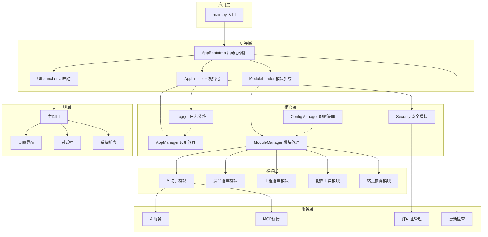
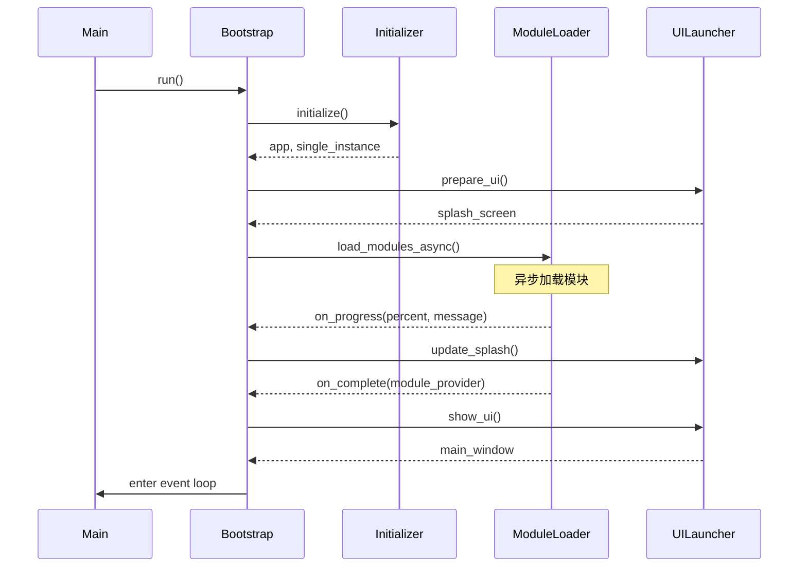
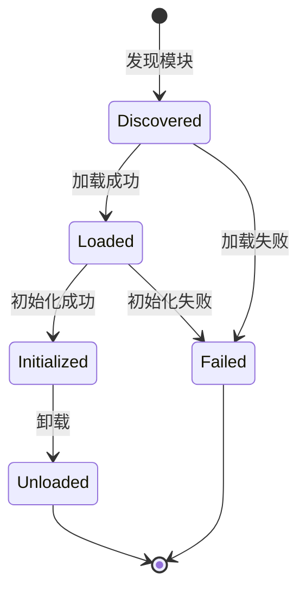
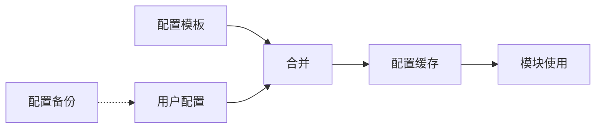
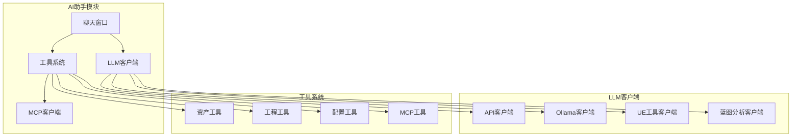
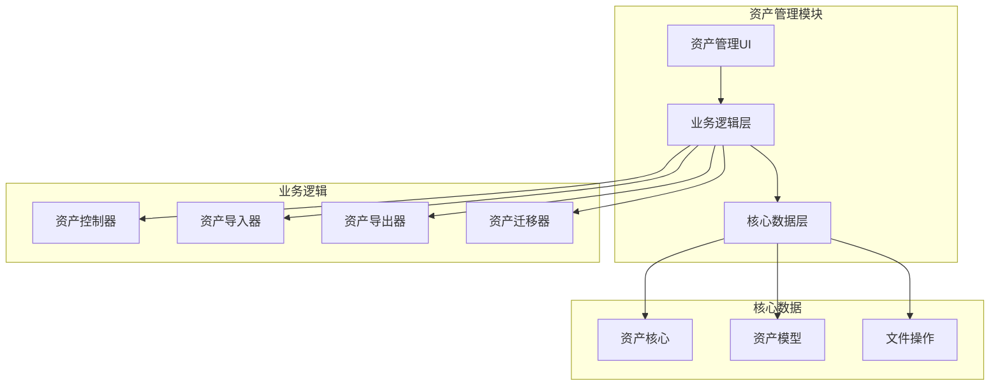
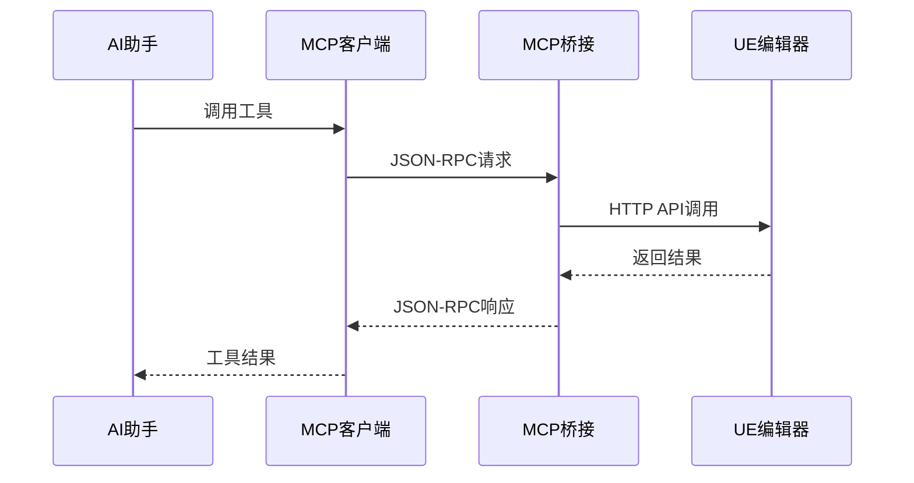
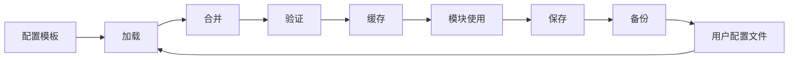
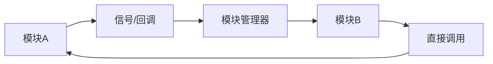

# UE Toolkit 系统架构

## 架构概览

UE Toolkit 采用分层模块化架构，将应用程序分为核心层、模块层和 UI 层，通过清晰的接口和依赖注入实现松耦合设计。



## 分层架构

### 1. 应用层 (Application Layer)

**职责**: 应用程序入口和生命周期管理

**核心文件**:

- `main.py`: 应用程序主入口
  - 设置 Python 路径
  - 处理命令行参数（如 `--reset-license`）
  - 清理临时目录
  - 调用 AppBootstrap 启动应用

**关键流程**:

```python
def main():
    # 1. 设置工作目录
    # 2. 清理旧临时目录
    # 3. 处理特殊参数
    # 4. 创建并运行 AppBootstrap
    bootstrap = AppBootstrap()
    return bootstrap.run()
```

### 2. 引导层 (Bootstrap Layer)

**职责**: 协调应用启动流程，管理启动阶段

**核心组件**:

#### AppBootstrap (启动协调器)

- **文件**: `core/bootstrap/app_bootstrap.py`
- **职责**:
  - 协调整个启动流程
  - 管理启动阶段的依赖关系
  - 处理启动异常和资源清理
  - 注册退出钩子

**启动流程**:



#### AppInitializer (应用初始化器)

- **文件**: `core/bootstrap/app_initializer.py`
- **职责**:
  - 创建 QApplication 实例
  - 初始化日志系统
  - 设置应用元数据
  - 初始化单实例管理器
  - 加载应用图标和样式

#### ModuleLoader (模块加载器)

- **文件**: `core/bootstrap/module_loader.py`
- **职责**:
  - 异步加载所有模块
  - 报告加载进度
  - 处理模块依赖关系
  - 提供模块访问接口

#### UILauncher (UI启动器)

- **文件**: `core/bootstrap/ui_launcher.py`
- **职责**:
  - 创建和显示启动画面
  - 创建主窗口
  - 初始化系统托盘
  - 管理 UI 生命周期

### 3. 核心层 (Core Layer)

**职责**: 提供应用程序的基础设施和公共服务

#### 模块管理 (Module Management)

**ModuleManager** (`core/module_manager.py`)

- 模块发现和注册
- 依赖关系解析（拓扑排序）
- 循环依赖检测
- 模块生命周期管理（加载、初始化、卸载）

**模块状态机**:



**模块接口** (`core/module_interface.py`)

```python
class ModuleInterface:
    def initialize(self, config_dir: str) -> bool
    def get_widget(self) -> QWidget
    def request_stop(self) -> None
    def cleanup(self) -> CleanupResult
```

#### 配置管理 (Configuration Management)

**ConfigManager** (`core/config/config_manager.py`)

- 配置模板和用户配置分离
- 配置版本管理和自动升级
- 配置缓存和热重载
- 自动备份和恢复机制

**配置层次结构**:



#### 安全模块 (Security)

**LicenseManager** (`core/security/license_manager.py`)

- 许可证状态缓存（5分钟有效期）
- 本地和服务器端验证
- 试用期管理
- 激活码验证

**MachineID** (`core/security/machine_id.py`)

- 生成唯一机器标识
- 基于硬件信息的指纹

**FeatureGate** (`core/security/feature_gate.py`)

- 功能权限控制
- 免费/付费功能区分

#### 日志系统 (Logging)

**Logger** (`core/logger.py`)

- 统一日志记录接口
- 多级别日志支持
- 日志文件管理
- 性能监控集成

### 4. 模块层 (Module Layer)

**职责**: 实现具体的业务功能

#### AI 助手模块 (AI Assistant)

**核心文件**: `modules/ai_assistant/ai_assistant.py`

**架构**:



**关键特性**:

- 支持多种 LLM 提供商（OpenAI、Claude、Gemini、DeepSeek 等）
- 本地模型支持（Ollama）
- MCP 协议集成（26+ 工具）
- 工具调用系统
- 对话历史管理
- 流式响应支持

#### 资产管理模块 (Asset Manager)

**核心文件**: `modules/asset_manager/asset_manager.py`

**架构**:



**支持的资产类型**:

- CONTENT (资产包)
- PLUGIN (插件)
- PROJECT (完整工程)
- OTHERS (通用多媒体)

#### 工程管理模块 (Project Manager)

**核心文件**: `modules/my_projects/my_projects.py`

**功能**:

- 自动扫描本地虚幻引擎项目
- 多版本工程管理
- 快速启动和重命名
- 项目路径解析

#### 配置工具模块 (Config Tool)

**核心文件**: `modules/config_tool/config_tool.py`

**功能**:

- 项目配置提取和应用
- 编辑器偏好设置同步
- 配置备份和回滚
- 版本匹配检查

### 5. UI 层 (UI Layer)

**职责**: 用户界面和交互

**核心组件**:

#### 主窗口 (Main Window)

- **文件**: `ui/ue_main_window.py`
- **职责**:
  - 管理模块标签页
  - 协调模块间通信
  - 处理窗口事件

#### 设置界面 (Settings Widget)

- **文件**: `ui/settings_widget.py`
- **职责**:
  - 全局设置管理
  - 模块配置界面
  - 主题切换

#### 系统托盘 (System Tray)

- **文件**: `ui/system_tray.py`
- **职责**:
  - 后台运行支持
  - 快捷操作菜单
  - 通知显示

### 6. 服务层 (Service Layer)

**职责**: 提供跨模块的公共服务

#### AI 服务 (AI Services)

**EmbeddingService** (`core/ai_services/embedding_service.py`)

- 使用 `BAAI/bge-small-zh-v1.5` 模型
- 提供 512 维向量化
- 支持语义检索

#### MCP 桥接 (MCP Bridge)

**BlueprintExtractorBridge** (`scripts/mcp_servers/blueprint_extractor_bridge.py`)

- 实现 MCP stdio 协议
- 连接 UE Editor HTTP API
- 提供 26+ 蓝图操作工具

**MCP 架构**:



#### 更新检查 (Update Checker)

**UpdateChecker** (`core/update_checker.py`)

- 后台检查更新
- 版本比较
- 更新通知

## 设计模式

### 1. 单例模式 (Singleton)

- **应用**: ThemeManager, LicenseManager
- **目的**: 确保全局唯一实例

### 2. 工厂模式 (Factory)

- **应用**: LLMClientFactory
- **目的**: 根据配置创建不同的 LLM 客户端

### 3. 观察者模式 (Observer)

- **应用**: 配置热重载、模块间通信
- **目的**: 解耦组件间的依赖

### 4. 策略模式 (Strategy)

- **应用**: 不同的资产导入策略
- **目的**: 支持多种资产类型的处理

### 5. 模板方法模式 (Template Method)

- **应用**: BaseLogic 基类
- **目的**: 定义模块的标准生命周期

## 数据流

### 配置数据流



### 模块通信流



## 性能优化

### 1. 异步加载

- 模块异步加载，避免阻塞 UI
- 配置异步保存
- 更新检查后台运行

### 2. 缓存机制

- 配置缓存（5分钟有效期）
- 许可证状态缓存
- 缩略图缓存

### 3. 懒加载

- AI 模型按需加载
- 聊天窗口预加载
- 模块延迟初始化

### 4. 资源管理

- 自动清理临时文件
- 进程监控和资源释放
- 内存优化（打包时排除未使用依赖）

## 扩展性

### 添加新模块

1. 创建模块目录 `modules/new_module/`
2. 实现 `ModuleInterface` 接口
3. 创建 `manifest.json` 描述模块
4. 模块管理器自动发现和加载

### 添加新工具

1. 在模块中实现工具函数
2. 注册到工具系统
3. AI 助手自动识别和调用

### 添加新 LLM 提供商

1. 继承 `BaseLLMClient`
2. 实现 `send_message` 方法
3. 在 `LLMClientFactory` 中注册

## 安全考虑

1. **敏感数据加密**: 使用 cryptography 加密 API 密钥
2. **系统密钥环**: 使用 keyring 安全存储凭证
3. **许可证验证**: 本地缓存 + 服务器端双重验证
4. **输入验证**: 所有用户输入经过验证
5. **安全扫描**: 使用 bandit 进行安全审计

## 错误处理

1. **分层异常处理**: 每层捕获和处理相应的异常
2. **用户友好提示**: 将技术错误转换为用户可理解的消息
3. **日志记录**: 详细记录错误堆栈和上下文
4. **优雅降级**: 非关键功能失败不影响核心功能
5. **资源清理**: 确保异常情况下资源正确释放
