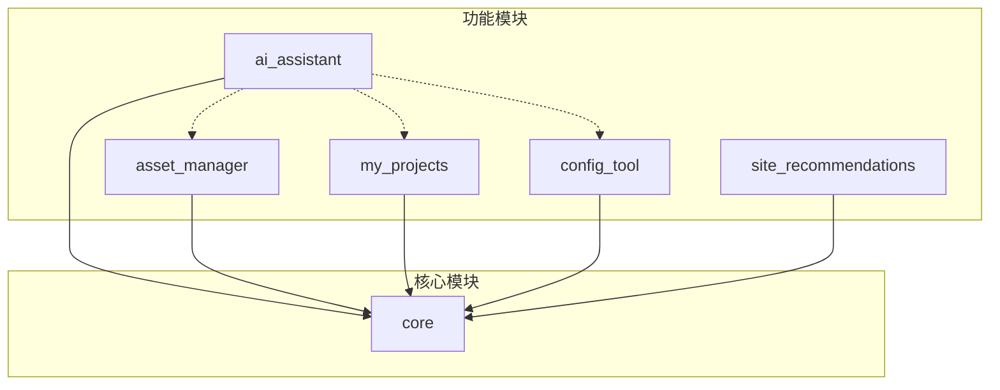

# UE Toolkit 依赖关系

## Python 依赖

### 必需依赖

#### UI 框架

```
PyQt6>=6.4.0
```

**用途**:

- 应用程序 UI 框架
- 窗口、对话框、控件
- 信号槽机制
- 事件循环

**使用位置**:

- `ui/`: 所有 UI 组件
- `modules/*/ui/`: 模块 UI
- `core/bootstrap/`: 应用启动

#### 图片处理

```
Pillow>=9.0.0
```

**用途**:

- 缩略图生成
- 图片格式转换
- 图片缩放和裁剪

**使用位置**:

- `modules/asset_manager/`: 资产缩略图
- `ui/thumbnail_cache.py`: 缩略图缓存

#### 进程管理

```
psutil>=5.9.0
```

**用途**:

- 进程监控
- 资源使用统计
- 进程管理

**使用位置**:

- `core/utils/performance_monitor.py`: 性能监控
- `modules/asset_manager/`: 自动清理
- `core/utils/ue_process_utils.py`: UE 进程管理

#### 拼音转换

```
pypinyin>=0.49.0
```

**用途**:

- 中文拼音转换
- 拼音搜索支持

**使用位置**:

- `modules/asset_manager/`: 资产搜索
- `modules/my_projects/`: 工程搜索

#### Word 文档生成

```
python-docx>=0.8.11
```

**用途**:

- 创建 Word 文档
- 资产说明文档生成

**使用位置**:

- `modules/asset_manager/`: 资产文档创建

### 可选依赖

#### 配置热重载

```
watchdog>=2.0.0
```

**用途**:

- 监控文件变化
- 配置热重载

**使用位置**:

- `core/base_logic.py`: watch_changes 功能

**注意**: 如果不安装，配置热重载功能将自动禁用

#### HTTP 请求

```
requests>=2.28.0
```

**用途**:

- HTTP API 调用
- URL 可达性检查
- 文件下载

**使用位置**:

- `core/security/license_manager.py`: 许可证验证
- `core/update_checker.py`: 更新检查
- `core/utils/validators.py`: URL 验证
- `scripts/mcp_servers/`: MCP 桥接

**注意**: 如果不安装，URL 可达性检查将自动跳过

#### YAML 配置

```
PyYAML>=6.0
```

**用途**:

- YAML 配置文件解析
- 配置文件读写

**使用位置**:

- `core/config/`: 配置管理
- `scripts/`: 脚本配置

### AI 相关依赖

#### NumPy

```
numpy>=1.24.0,<2.0
```

**用途**:

- 数值计算
- 向量操作
- FAISS 依赖

**使用位置**:

- `core/ai_services/embedding_service.py`: 向量计算

**注意**: 版本锁定在 1.x，因为 FAISS 需要

#### 语义模型

```
sentence-transformers>=2.2.0
```

**用途**:

- 语义嵌入向量生成
- 意图识别

**使用位置**:

- `core/ai_services/embedding_service.py`: 嵌入服务

**打包说明**: 开发环境保留，打包时排除以减小体积

#### 向量存储

```
faiss-cpu>=1.7.4
```

**用途**:

- 向量存储和检索
- 语义搜索

**使用位置**:

- `modules/ai_assistant/`: AI 记忆系统

**打包说明**: 开发环境保留，打包时排除以减小体积

#### GitHub 集成

```
PyGithub>=1.59.0
```

**用途**:

- GitHub 代码搜索
- 仓库访问

**使用位置**:

- `modules/ai_assistant/`: GitHub 连接器

#### Ollama 支持

```
httpx>=0.24.0
```

**用途**:

- Ollama 本地模型调用
- 异步 HTTP 请求

**使用位置**:

- `modules/ai_assistant/clients/ollama_llm_client.py`: Ollama 客户端

### 安全依赖

#### 系统密钥环

```
keyring>=24.0.0
```

**用途**:

- 系统密钥环集成
- 安全存储 API 密钥

**使用位置**:

- `core/security/secure_config_manager.py`: 安全配置管理

#### 加密库

```
cryptography>=41.0.0
```

**用途**:

- 敏感数据加密
- 许可证加密

**使用位置**:

- `core/security/license_crypto.py`: 许可证加密
- `core/security/secure_config_manager.py`: 配置加密

### 开发依赖

#### 测试框架

```
pytest>=7.4.0
pytest-qt>=4.2.0
pytest-cov>=4.1.0
```

**用途**:

- 单元测试
- Qt 组件测试
- 代码覆盖率

#### 类型检查

```
mypy>=1.7.0
```

**用途**:

- 静态类型检查
- 类型注解验证

#### 代码质量

```
flake8>=6.1.0
```

**用途**:

- 代码风格检查
- PEP 8 合规性

#### 安全扫描

```
bandit>=1.7.5
```

**用途**:

- 安全漏洞扫描
- 代码安全审计

## 模块依赖关系

### 模块依赖图



### 模块间依赖

#### AI 助手模块

**依赖**:

- `core`: 核心功能
- `asset_manager`: 资产工具（可选）
- `my_projects`: 工程工具（可选）
- `config_tool`: 配置工具（可选）

**被依赖**: 无

#### 资产管理模块

**依赖**:

- `core`: 核心功能

**被依赖**:

- `ai_assistant`: 提供资产操作工具

#### 工程管理模块

**依赖**:

- `core`: 核心功能

**被依赖**:

- `ai_assistant`: 提供工程操作工具

#### 配置工具模块

**依赖**:

- `core`: 核心功能

**被依赖**:

- `ai_assistant`: 提供配置操作工具

#### 站点推荐模块

**依赖**:

- `core`: 核心功能

**被依赖**: 无

### 依赖解析规则

1. **拓扑排序**: 按依赖关系排序模块加载顺序
2. **循环检测**: 检测并拒绝循环依赖
3. **自依赖检测**: 检测并拒绝自依赖
4. **可选依赖**: 支持可选依赖，缺失时不影响加载

## 外部服务依赖

### 许可证服务

**端点**: 配置在 `core/security/license_manager.py`

**API**:

- `/api/v2/license/status`: 获取许可证状态
- `/api/v2/license/activate`: 激活许可证
- `/api/v2/trial/start`: 开始试用
- `/api/v2/trial/reset`: 重置试用（管理员）

**依赖**: `requests` 库

### 更新服务

**端点**: 配置在 `core/update_checker.py`

**API**:

- `/api/updates/latest`: 获取最新版本信息

**依赖**: `requests` 库

### UE Editor HTTP API

**端点**: `http://localhost:30010`

**API**:

- `/BlueprintExtractor/*`: 蓝图操作 API

**依赖**:

- Blueprint Extractor 插件
- UE 编辑器运行中

### LLM 提供商 API

**支持的提供商**:

- OpenAI API
- Anthropic Claude API
- Google Gemini API
- DeepSeek API
- 自定义 API（BYOK）
- Ollama（本地）

**依赖**:

- `requests` 库（API 调用）
- `httpx` 库（Ollama）

## 系统依赖

### Windows 系统

**必需**:

- Windows 10 或更高版本
- .NET Framework 4.7.2 或更高版本（PyQt6 依赖）

**可选**:

- Visual C++ Redistributable（某些依赖需要）

### Python 环境

**版本**: Python 3.8+

**推荐**: Python 3.11

### 虚幻引擎

**支持版本**:

- UE 4.27+
- UE 5.0+
- UE 5.4（蓝图分析功能）

**注意**: 不同功能对 UE 版本的要求不同

## 打包依赖

### PyInstaller

**版本**: 最新稳定版

**配置文件**: `scripts/package/config/ue_toolkit.spec`

**排除的依赖**:

- `sentence-transformers`
- `faiss-cpu`
- `numpy`（部分）

**原因**: 减小打包体积（311MB → 50-80MB）

### Inno Setup

**版本**: 6.0+

**配置文件**: `scripts/package/config/UeToolkitpack.iss`

**用途**: 创建 Windows 安装程序

## 依赖管理

### 安装依赖

```bash
# 安装所有依赖
pip install -r requirements.txt

# 使用国内镜像源
pip install -r requirements.txt -i https://pypi.tuna.tsinghua.edu.cn/simple/

# 只安装必需依赖
pip install PyQt6 Pillow psutil pypinyin python-docx
```

### 更新依赖

```bash
# 更新所有依赖到最新版本
pip install --upgrade -r requirements.txt

# 更新特定依赖
pip install --upgrade PyQt6
```

### 依赖冲突解决

1. **NumPy 版本冲突**:
   - 锁定 NumPy < 2.0（FAISS 要求）
   - 如果其他库需要 NumPy 2.0，考虑移除 FAISS

2. **PyQt6 版本冲突**:
   - 确保所有 PyQt6 相关包版本一致
   - 避免混用 PyQt5 和 PyQt6

3. **加密库冲突**:
   - `cryptography` 可能与某些库冲突
   - 使用虚拟环境隔离

## 依赖安全

### 安全扫描

```bash
# 使用 bandit 扫描代码
bandit -r . -f json -o security_report.json

# 检查依赖漏洞
pip-audit
```

### 依赖更新策略

1. **定期更新**: 每月检查依赖更新
2. **安全更新**: 立即应用安全补丁
3. **测试**: 更新后进行完整测试
4. **锁定版本**: 生产环境锁定依赖版本

## 国内镜像源

### 推荐镜像源

**清华大学镜像源**:

```bash
pip install -r requirements.txt -i https://pypi.tuna.tsinghua.edu.cn/simple/
```

**阿里云镜像源**:

```bash
pip install -r requirements.txt -i https://mirrors.aliyun.com/pypi/simple/
```

**中科大镜像源**:

```bash
pip install -r requirements.txt -i https://pypi.mirrors.ustc.edu.cn/simple/
```

**豆瓣镜像源**:

```bash
pip install -r requirements.txt -i https://pypi.douban.com/simple/
```

### 永久配置

```bash
# 配置 pip 使用国内镜像源
pip config set global.index-url https://pypi.tuna.tsinghua.edu.cn/simple/
```

## 依赖许可证

### 主要依赖许可证

- **PyQt6**: GPL v3 / Commercial
- **Pillow**: HPND License
- **psutil**: BSD 3-Clause
- **pypinyin**: MIT
- **python-docx**: MIT
- **requests**: Apache 2.0
- **PyYAML**: MIT
- **sentence-transformers**: Apache 2.0
- **faiss-cpu**: MIT
- **keyring**: MIT
- **cryptography**: Apache 2.0 / BSD

### 许可证合规性

1. **GPL 依赖**: PyQt6 使用 GPL v3，需要遵守 GPL 条款
2. **商业许可**: 如需商业发布，考虑购买 PyQt6 商业许可
3. **归属声明**: 在应用中包含依赖的许可证声明

## 依赖优化

### 减小依赖体积

1. **排除未使用的依赖**: 打包时排除 AI 相关依赖
2. **使用轻量级替代**: 考虑使用更小的库
3. **按需导入**: 延迟导入大型库

### 加快安装速度

1. **使用国内镜像**: 提高下载速度
2. **使用缓存**: pip 缓存已下载的包
3. **使用 wheel**: 优先使用预编译的 wheel 包

## 依赖文档

### 查看依赖信息

```bash
# 列出已安装的依赖
pip list

# 查看依赖详情
pip show PyQt6

# 生成依赖树
pip install pipdeptree
pipdeptree
```

### 导出依赖

```bash
# 导出当前环境的依赖
pip freeze > requirements_freeze.txt

# 导出项目依赖（推荐）
pip install pipreqs
pipreqs . --force
```
