# UE Toolkit 工作流程

## 应用启动流程

### 完整启动流程

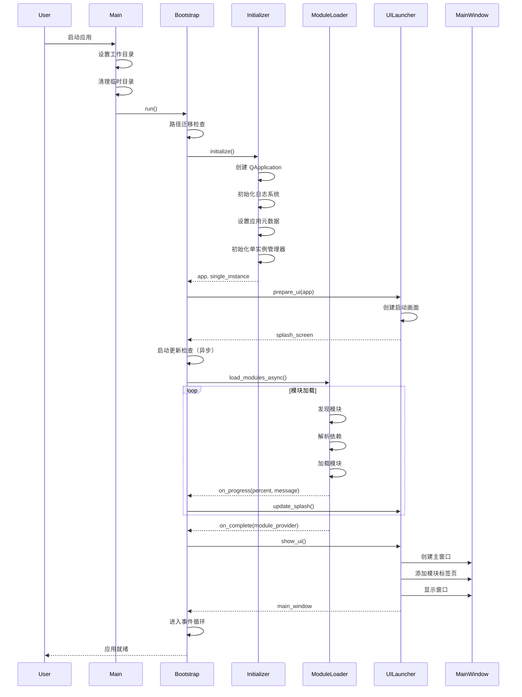

### 启动阶段详解

#### 1. 预初始化阶段

- 设置 Python 路径
- 设置工作目录
- 清理旧临时目录
- 处理命令行参数

#### 2. 路径迁移阶段

- 检查旧版本数据路径
- 迁移配置文件
- 迁移用户数据

#### 3. 应用初始化阶段

- 创建 QApplication 实例
- 初始化日志系统
- 设置应用元数据（名称、版本、图标）
- 初始化单实例管理器
- 加载应用图标和样式

#### 4. UI 准备阶段

- 创建启动画面
- 显示启动画面
- 设置启动画面样式

#### 5. 更新检查阶段（异步）

- 后台检查更新
- 获取最新版本信息
- 比较版本号
- 准备更新通知

#### 6. 模块加载阶段

- 扫描 modules 目录
- 解析 manifest.json
- 构建依赖图
- 检测循环依赖
- 拓扑排序
- 按顺序加载模块
- 初始化模块
- 报告加载进度

#### 7. UI 显示阶段

- 创建主窗口
- 添加模块标签页
- 初始化系统托盘
- 关闭启动画面
- 显示主窗口

#### 8. 事件循环阶段

- 进入 Qt 事件循环
- 处理用户交互
- 执行后台任务

## 模块生命周期

### 模块加载流程

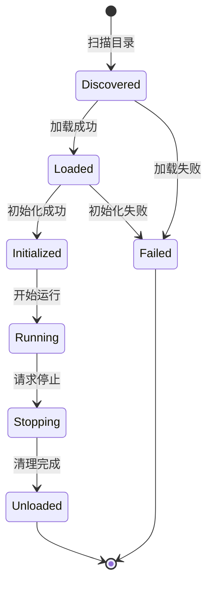

### 模块发现

1. 扫描 `modules/` 目录
2. 查找 `manifest.json` 文件
3. 解析模块元数据
4. 验证模块结构
5. 注册模块信息

### 模块加载

1. 检查依赖关系
2. 导入模块 Python 包
3. 实例化模块类
4. 验证接口实现
5. 更新模块状态

### 模块初始化

1. 调用 `initialize(config_dir)` 方法
2. 加载模块配置
3. 初始化模块资源
4. 创建 UI 组件
5. 注册事件处理器

### 模块运行

1. 响应用户交互
2. 执行业务逻辑
3. 更新 UI 状态
4. 保存配置变更

### 模块停止

1. 调用 `request_stop()` 方法
2. 停止后台任务
3. 保存当前状态
4. 释放资源

### 模块卸载

1. 调用 `cleanup()` 方法
2. 清理临时文件
3. 关闭数据库连接
4. 释放内存资源
5. 更新模块状态

## 配置管理流程

### 配置加载流程

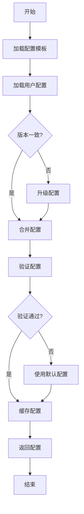

### 配置保存流程

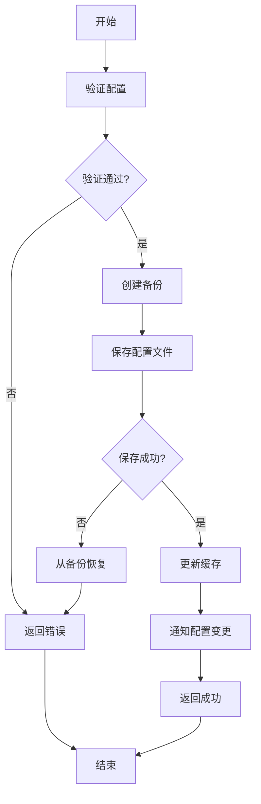

### 配置升级流程

1. 检测版本差异
2. 加载迁移规则
3. 应用迁移规则
4. 保留用户设置
5. 添加新字段默认值
6. 删除废弃字段
7. 验证升级后的配置
8. 保存升级后的配置

## 资产管理流程

### 资产导入流程

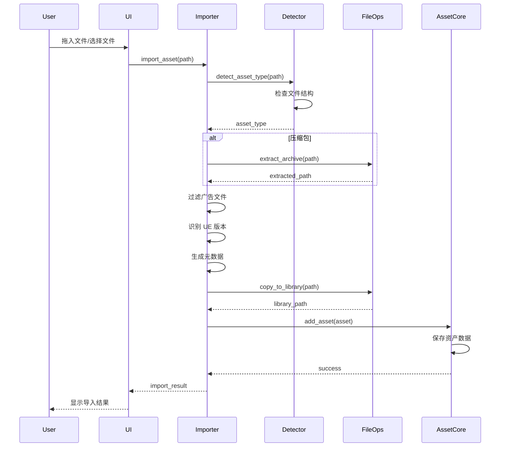

### 资产导出流程

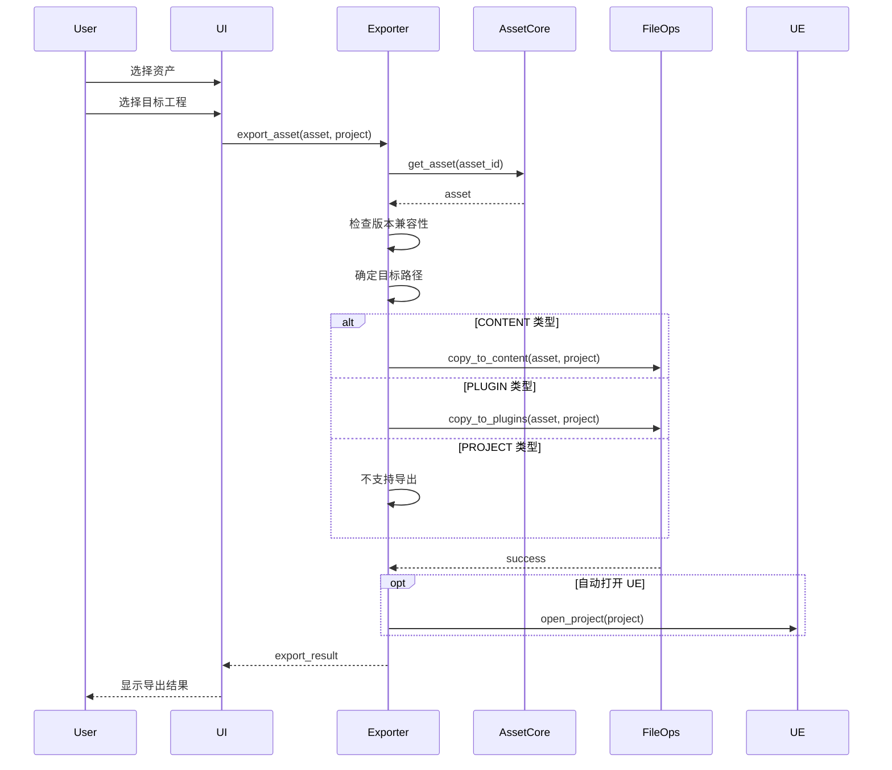

### 资产预览流程

1. 选择资产
2. 选择预览工程
3. 复制资产到预览工程
4. 启动 UE 编辑器
5. 打开预览工程
6. 用户预览资产
7. 关闭 UE 编辑器
8. 可选：设置缩略图

## AI 助手工作流程

### 对话流程

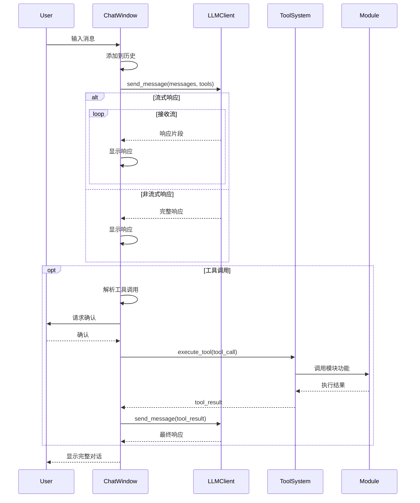

### 工具调用流程

1. LLM 识别需要调用工具
2. 返回工具调用请求
3. 解析工具名称和参数
4. 请求用户确认（可选）
5. 执行工具函数
6. 获取执行结果
7. 将结果发送回 LLM
8. LLM 生成最终响应

### MCP 工具调用流程

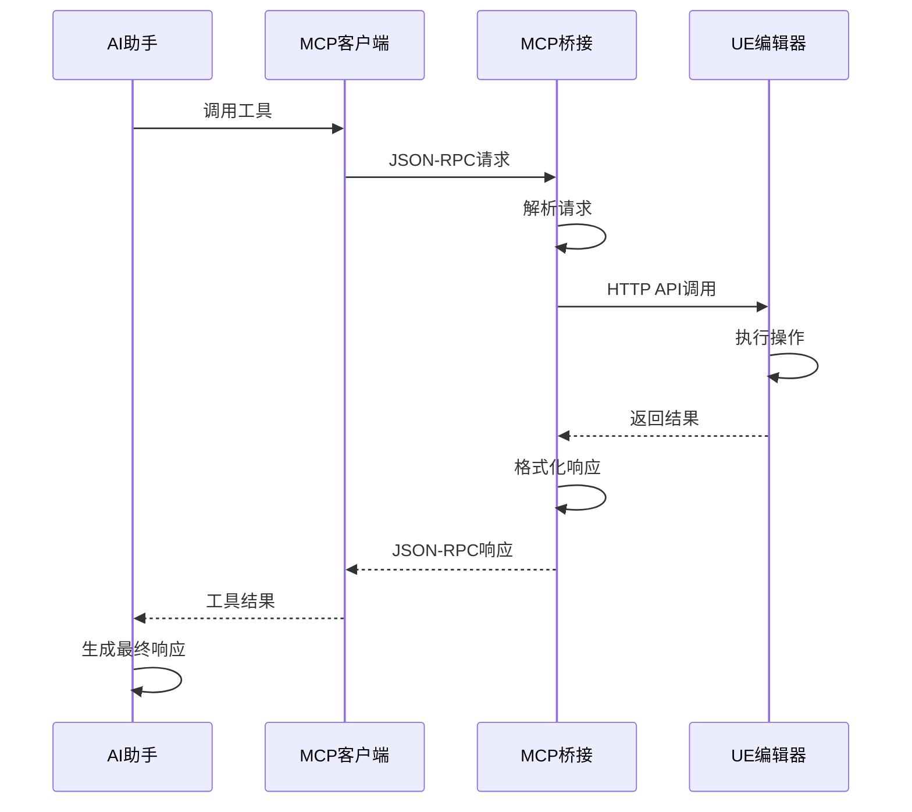

## 工程管理流程

### 工程扫描流程

1. 扫描配置的磁盘路径
2. 查找 `.uproject` 文件
3. 解析工程文件
4. 识别 UE 版本
5. 检测工程类型（C++/蓝图）
6. 提取工程元数据
7. 保存工程信息
8. 更新 UI 显示

### 工程启动流程

1. 选择工程
2. 检查 UE 版本
3. 查找 UE 编辑器路径
4. 构建启动命令
5. 启动 UE 编辑器
6. 监控进程状态
7. 更新最后打开时间

### 工程重命名流程

1. 选择工程
2. 输入新名称
3. 验证名称合法性
4. 关闭 UE 编辑器（如果打开）
5. 重命名工程文件
6. 更新工程文件内容
7. 重命名工程目录
8. 更新工程信息
9. 刷新 UI 显示

## 配置工具流程

### 配置提取流程

1. 选择源工程
2. 选择配置类型
3. 定位配置文件
4. 读取配置文件
5. 创建配置快照
6. 保存快照元数据
7. 显示提取结果

### 配置应用流程

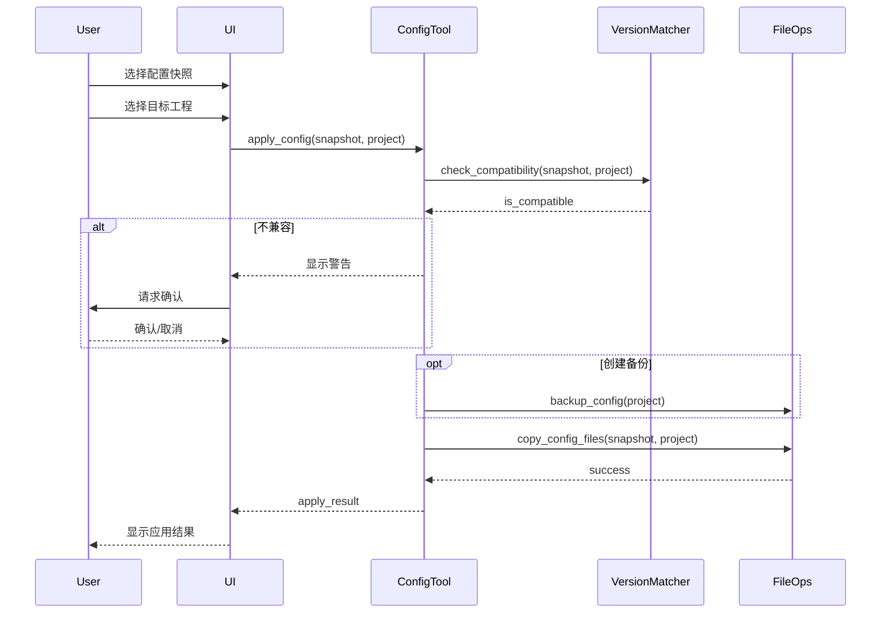

## 许可证验证流程

### 许可证状态检查流程

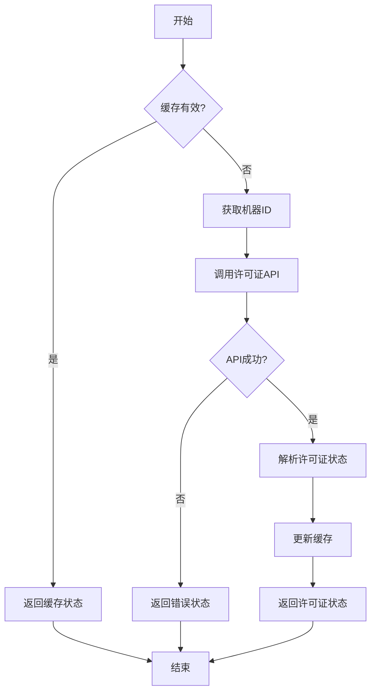

### 许可证激活流程

1. 用户输入激活码
2. 验证激活码格式
3. 获取机器 ID
4. 调用激活 API
5. 服务器验证激活码
6. 绑定机器 ID
7. 返回激活结果
8. 保存许可证信息
9. 刷新许可证状态
10. 显示激活结果

### 试用流程

1. 检查是否已试用
2. 获取机器 ID
3. 调用试用 API
4. 服务器记录试用
5. 返回试用期限
6. 保存试用信息
7. 刷新许可证状态
8. 显示试用信息

## 更新检查流程

### 更新检查流程

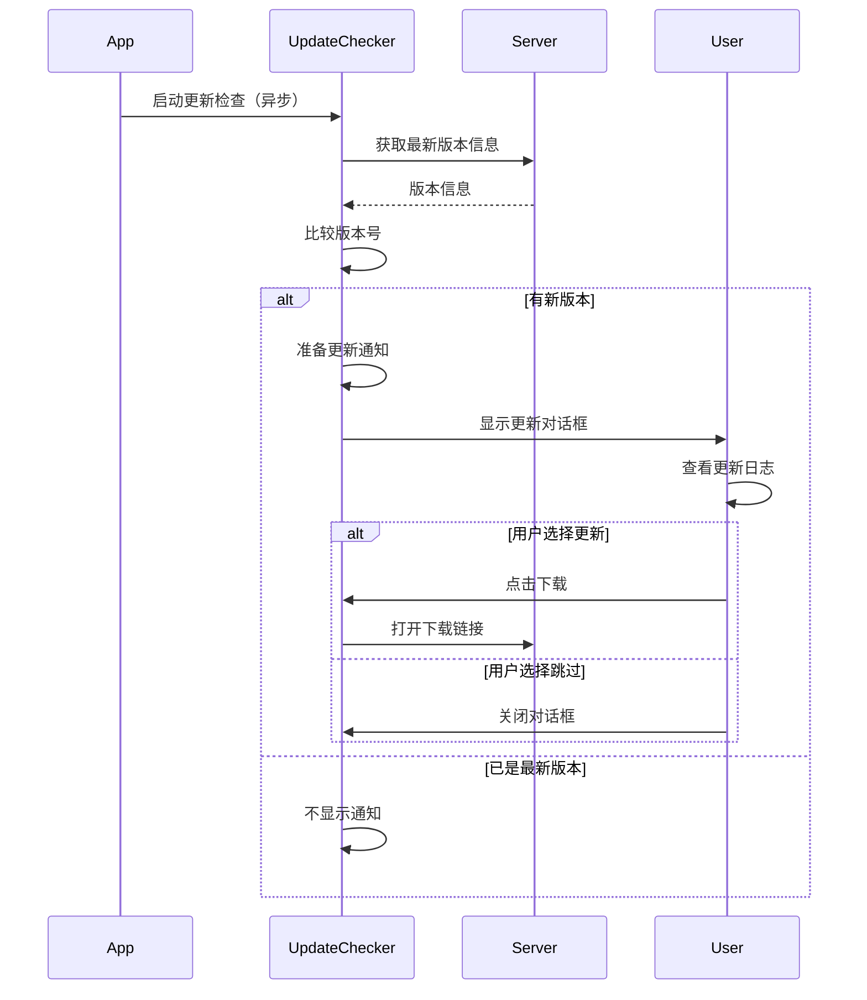

## 错误处理流程

### 全局错误处理

1. 捕获异常
2. 记录详细日志
3. 分析错误类型
4. 生成用户友好消息
5. 显示错误对话框
6. 提供解决建议
7. 可选：发送错误报告

### 模块错误处理

1. 模块内部捕获异常
2. 记录模块日志
3. 尝试恢复操作
4. 如果无法恢复，向上传播
5. 更新模块状态
6. 通知用户

### 网络错误处理

1. 检测网络连接
2. 设置超时时间
3. 捕获网络异常
4. 重试机制（可选）
5. 降级处理
6. 通知用户

## 资源清理流程

### 应用退出流程

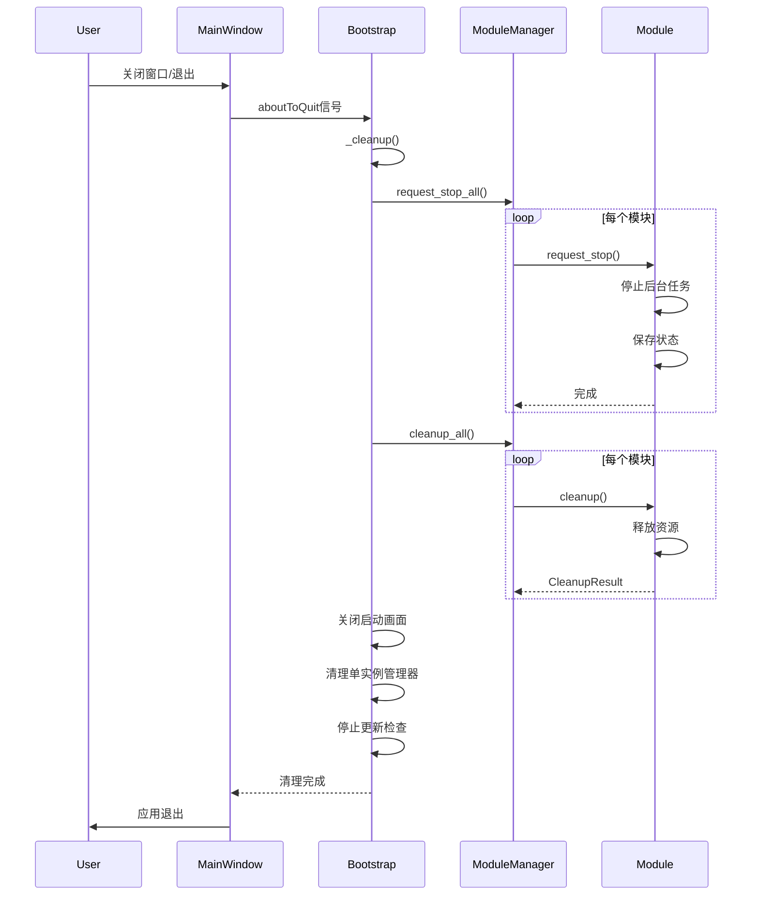

### 资源清理顺序

1. 请求所有模块停止
2. 等待模块停止完成
3. 清理模块资源
4. 关闭启动画面
5. 清理单实例管理器
6. 停止更新检查线程
7. 保存应用状态
8. 关闭日志系统
9. 释放 QApplication 资源
10. 退出应用

## 性能优化流程

### 启动优化

1. 延迟加载非关键模块
2. 异步加载模块
3. 预加载常用资源
4. 缓存配置数据
5. 并行初始化

### 运行时优化

1. 使用配置缓存
2. 懒加载 AI 模型
3. 异步执行耗时操作
4. 使用线程池
5. 定期清理缓存

### 内存优化

1. 及时释放不用的资源
2. 使用弱引用
3. 限制缓存大小
4. 监控内存使用
5. 定期垃圾回收
