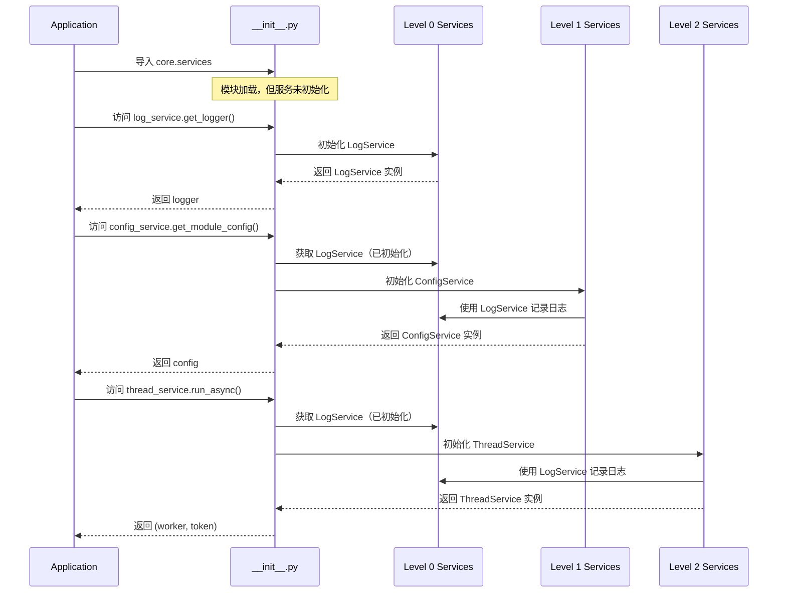
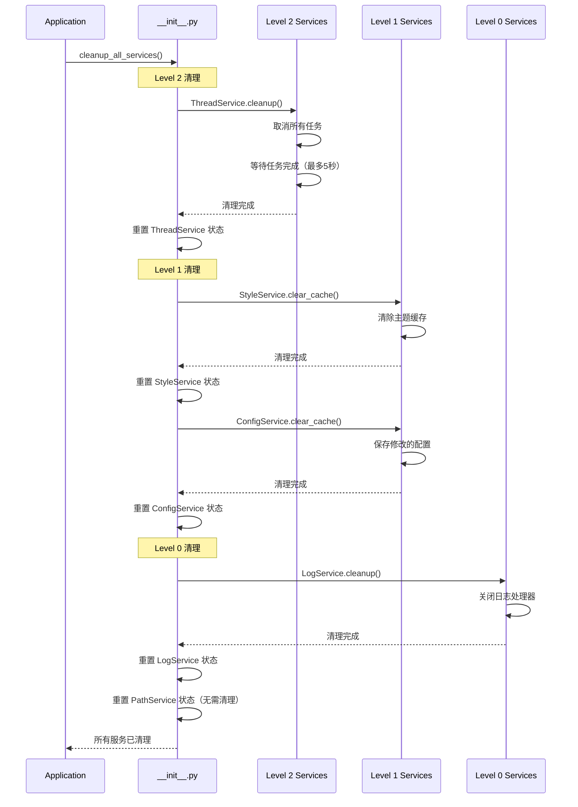
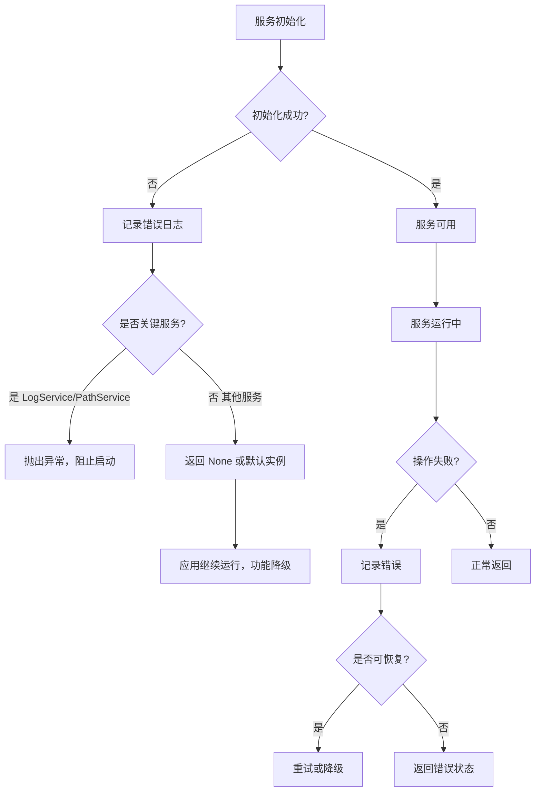

# Design Document

## Overview

本文档定义了 UE Toolkit AI 项目架构重构的详细设计。重构采用**方案 A（最小改动）**，通过创建统一的服务层（Service Layer）来解决共用服务分散和横切逻辑混用的问题。

### 设计目标

1. **降低耦合度**：通过服务层统一访问共用服务，减少模块间直接依赖
2. **提高可维护性**：集中管理服务实例，简化配置和监控
3. **保持向后兼容**：现有代码可以继续工作，支持渐进式迁移
4. **最小化风险**：只封装现有功能，不改变底层实现

### 核心原则

- **封装而非重写**：服务层封装现有工具类，不修改底层实现
- **单例模式**：使用模块级单例确保全局唯一实例
- **懒加载**：服务在首次访问时初始化，减少启动时间
- **依赖分层**：严格的依赖层级防止循环依赖

## Architecture

### 服务层整体架构

```
┌─────────────────────────────────────────────────────────────┐
│                     Application Layer                        │
│  (modules/*, ui/*, core/app_manager.py)                     │
└────────────────────────┬────────────────────────────────────┘
                         │ imports from
                         ▼
┌─────────────────────────────────────────────────────────────┐
│                    Service Layer (core/services/)            │
│  ┌──────────────┐  ┌──────────────┐  ┌──────────────┐     │
│  │ ThreadService│  │ ConfigService│  │  LogService  │     │
│  └──────┬───────┘  └──────┬───────┘  └──────┬───────┘     │
│         │                  │                  │              │
│  ┌──────┴───────┐  ┌──────┴───────┐                        │
│  │ StyleService │  │  PathService │                        │
│  └──────────────┘  └──────────────┘                        │
└────────────────────────┬────────────────────────────────────┘
                         │ delegates to
                         ▼
┌─────────────────────────────────────────────────────────────┐
│              Legacy Utilities (core/utils/, core/config/)   │
│  ┌──────────────┐  ┌──────────────┐  ┌──────────────┐     │
│  │ThreadManager │  │ConfigManager │  │    Logger    │     │
│  └──────────────┘  └──────────────┘  └──────────────┘     │
│  ┌──────────────┐  ┌──────────────┐                        │
│  │ StyleSystem  │  │  PathUtils   │                        │
│  └──────────────┘  └──────────────┘                        │
└─────────────────────────────────────────────────────────────┘
```

### 服务依赖层级

```
Level 2 (Highest)
┌──────────────────┐
│  ThreadService   │  ← 可以依赖 Level 0 和 Level 1
└──────────────────┘

Level 1 (Middle)
┌──────────────────┐  ┌──────────────────┐
│  ConfigService   │  │  StyleService    │  ← 可以依赖 Level 0
└──────────────────┘  └──────────────────┘

Level 0 (Lowest)
┌──────────────────┐  ┌──────────────────┐
│   LogService     │  │   PathService    │  ← 无依赖
└──────────────────┘  └──────────────────┘
```

### 服务依赖矩阵

| 服务 \ 依赖       | LogService | PathService | ConfigService | StyleService | ThreadService |
| ----------------- | ---------- | ----------- | ------------- | ------------ | ------------- |
| **LogService**    | -          | ❌          | ❌            | ❌           | ❌            |
| **PathService**   | ❌         | -           | ❌            | ❌           | ❌            |
| **ConfigService** | ✅         | ✅          | -             | ❌           | ❌            |
| **StyleService**  | ✅         | ❌          | ❌            | -            | ❌            |
| **ThreadService** | ✅         | ❌          | ❌            | ❌           | -             |

**说明**：

- ✅ 表示允许依赖
- ❌ 表示禁止依赖
- Level 0 服务不依赖任何服务
- Level 1 服务只能依赖 Level 0 服务
- Level 2 服务可以依赖 Level 0 和 Level 1 服务

### 服务初始化时序图



### 服务清理时序图



### 服务资源占用和生命周期

| 服务              | 创建者                 | 资源占用                     | 生命周期        | 清理责任           | 重建策略           |
| ----------------- | ---------------------- | ---------------------------- | --------------- | ------------------ | ------------------ |
| **LogService**    | \_get_log_service()    | 文件句柄、内存缓冲区         | 应用启动 → 关闭 | 关闭文件句柄       | 清理后可重新初始化 |
| **PathService**   | \_get_path_service()   | 无（只提供路径）             | 应用启动 → 关闭 | 无需清理           | 清理后可重新初始化 |
| **ConfigService** | \_get_config_service() | 内存缓存、ConfigManager 实例 | 应用启动 → 关闭 | 保存修改的配置     | 清理后可重新初始化 |
| **StyleService**  | \_get_style_service()  | 主题缓存（内存）             | 应用启动 → 关闭 | 清除缓存           | 清理后可重新初始化 |
| **ThreadService** | \_get_thread_service() | 线程池、Worker 实例          | 应用启动 → 关闭 | 取消任务、等待完成 | 清理后可重新初始化 |

### 异常和降级路径



## Components and Interfaces

### 1. ThreadService

**职责**：统一的线程调度服务，封装 ThreadManager

**文件路径**：`core/services/thread_service.py`

#### 公共 API 表

| 方法                 | 参数                                                                                                                                                                             | 返回值                           | 异常                      | 线程安全 | 说明                                    |
| -------------------- | -------------------------------------------------------------------------------------------------------------------------------------------------------------------------------- | -------------------------------- | ------------------------- | -------- | --------------------------------------- |
| `__init__()`         | 无                                                                                                                                                                               | None                             | 无                        | 是       | 初始化线程服务，创建 ThreadManager 实例 |
| `run_async()`        | task_func: Callable<br>on_result: Optional[Callable]<br>on_error: Optional[Callable]<br>on_finished: Optional[Callable]<br>on_progress: Optional[Callable]<br>\*args, \*\*kwargs | Tuple[Worker, CancellationToken] | TypeError（参数类型错误） | 是       | 异步执行任务，返回 Worker 和取消令牌    |
| `cancel_task()`      | task_identifier: Union[Worker, CancellationToken]                                                                                                                                | None                             | TypeError（参数类型错误） | 是       | 取消任务（协作式取消）                  |
| `get_thread_usage()` | 无                                                                                                                                                                               | Dict[str, int]                   | 无                        | 是       | 获取线程使用统计信息                    |
| `cleanup()`          | 无                                                                                                                                                                               | None                             | 无                        | 是       | 清理所有线程资源，最多等待 5 秒         |

#### 边界行为

- **多次 cancel**：对同一任务多次调用 cancel_task() 是幂等的，不会产生错误
- **重复 init**：ThreadService 是单例，重复初始化会返回同一实例
- **任务已完成时 cancel**：取消已完成的任务不会产生错误，只是设置取消标志
- **cleanup 超时**：如果任务在 5 秒内未完成，会记录警告但不会阻塞

#### 类定义

```python
from typing import Callable, Optional, Tuple, Dict, Union, Any
from PyQt6.QtCore import QThread
from core.utils.thread_utils import ThreadManager, Worker, CancellationToken

class ThreadService:
    """统一的线程调度服务

    封装 ThreadManager，提供简化的异步任务执行接口
    """

    def __init__(self):
        """初始化线程服务"""
        self._thread_manager = ThreadManager()
        print("[ThreadService] 初始化完成")

    def run_async(
        self,
        task_func: Callable,
        on_result: Optional[Callable[[Any], None]] = None,
        on_error: Optional[Callable[[str], None]] = None,
        on_finished: Optional[Callable[[], None]] = None,
        on_progress: Optional[Callable[[int], None]] = None,
        *args,
        **kwargs
    ) -> Tuple[Worker, CancellationToken]:
        """异步执行任务

        Args:
            task_func: 任务函数，可选接受 cancel_token 参数
            on_result: 结果回调函数
            on_error: 错误回调函数
            on_finished: 完成回调函数
            on_progress: 进度回调函数
            *args: 传递给任务函数的位置参数
            **kwargs: 传递给任务函数的关键字参数

        Returns:
            (Worker, CancellationToken): Worker 实例和取消令牌

        Example:
            def my_task(cancel_token):
                for i in range(100):
                    if cancel_token.is_cancelled():
                        return None
                    # do work
                return "完成"

            worker, token = thread_service.run_async(
                my_task,
                on_result=lambda result: print(result)
            )

            # 取消任务
            thread_service.cancel_task(token)

        Note:
            ThreadManager 会自动检测任务函数签名，如果函数有 cancel_token 参数，
            则自动注入 CancellationToken 实例。Worker 对象内部持有 cancel_token 属性。
        """
        thread, worker = self._thread_manager.run_in_thread(
            task_func,
            on_result=on_result,
            on_error=on_error,
            on_finished=on_finished,
            on_progress=on_progress,
            *args,
            **kwargs
        )
        # Worker 对象内部已经有 cancel_token 属性（由 ThreadManager 创建）
        return worker, worker.cancel_token

    def cancel_task(self, task_identifier: Union[Worker, CancellationToken]) -> None:
        """取消任务（协作式取消）

        Args:
            task_identifier: Worker 实例或 CancellationToken

        Note:
            这是协作式取消，任务函数必须主动检查 cancel_token.is_cancelled()
        """
        if isinstance(task_identifier, Worker):
            task_identifier.cancel()
        elif isinstance(task_identifier, CancellationToken):
            task_identifier.cancel()
        else:
            raise TypeError(f"task_identifier 必须是 Worker 或 CancellationToken，收到: {type(task_identifier)}")

    def get_thread_usage(self) -> Dict[str, int]:
        """获取线程使用情况

        Returns:
            线程使用统计信息
        """
        return self._thread_manager.get_thread_usage()

    def cleanup(self) -> None:
        """清理所有线程资源"""
        self._thread_manager.cleanup()
```

### 2. ConfigService

**职责**：统一的配置访问服务，管理多个模块的 ConfigManager 实例

**文件路径**：`core/services/config_service.py`

#### 公共 API 表

| 方法                    | 参数                                                                             | 返回值         | 异常                                                                    | 线程安全 | 说明                                         |
| ----------------------- | -------------------------------------------------------------------------------- | -------------- | ----------------------------------------------------------------------- | -------- | -------------------------------------------- |
| `__init__()`            | 无                                                                               | None           | 无                                                                      | 是       | 初始化配置服务，创建 ConfigManager 注册表    |
| `get_module_config()`   | module_name: str<br>template_path: Optional[Path]<br>force_reload: bool = False  | Dict[str, Any] | FileNotFoundError（模板不存在）<br>json.JSONDecodeError（配置格式错误） | 是       | 获取模块配置，首次访问自动创建 ConfigManager |
| `save_module_config()`  | module_name: str<br>config: Dict[str, Any]<br>backup_reason: str = "manual_save" | bool           | 无                                                                      | 是       | 保存模块配置，返回是否成功                   |
| `update_config_value()` | module_name: str<br>key: str<br>value: Any                                       | bool           | 无                                                                      | 是       | 更新配置值，支持点号分隔的嵌套键             |
| `clear_cache()`         | module_name: Optional[str] = None                                                | None           | 无                                                                      | 是       | 清除配置缓存，None 表示清除所有              |

#### 边界行为

- **首次访问自动创建**：get_module_config() 首次访问时自动创建 ConfigManager
- **保存不存在的模块**：save_module_config() 会自动创建 ConfigManager
- **更新不存在的模块**：update_config_value() 会自动创建 ConfigManager
- **配置文件损坏**：自动从备份恢复，如果备份也损坏则使用模板重新初始化
- **并发访问**：ConfigManager 内部使用缓存机制，支持并发读取

#### 类定义

```python
from typing import Dict, Any, Optional
from pathlib import Path
from core.config.config_manager import ConfigManager

class ConfigService:
    """统一的配置访问服务

    管理多个模块的 ConfigManager 实例，提供简化的配置访问接口
    """

    def __init__(self):
        """初始化配置服务"""
        from core.services import log_service
        self._config_managers: Dict[str, ConfigManager] = {}
        self._logger = log_service.get_logger("config_service")
        self._logger.info("ConfigService 初始化完成")

    def _get_or_create_manager(
        self,
        module_name: str,
        template_path: Optional[Path] = None
    ) -> ConfigManager:
        """获取或创建 ConfigManager 实例

        Args:
            module_name: 模块名称
            template_path: 配置模板路径

        Returns:
            ConfigManager 实例
        """
        if module_name not in self._config_managers:
            self._config_managers[module_name] = ConfigManager(
                module_name,
                template_path=template_path
            )
            self._logger.debug(f"为模块 {module_name} 创建 ConfigManager")
        return self._config_managers[module_name]

    def get_module_config(
        self,
        module_name: str,
        template_path: Optional[Path] = None,
        force_reload: bool = False
    ) -> Dict[str, Any]:
        """获取模块配置

        Args:
            module_name: 模块名称
            template_path: 配置模板路径（首次访问时需要）
            force_reload: 是否强制重新加载

        Returns:
            模块配置字典
        """
        manager = self._get_or_create_manager(module_name, template_path)
        return manager.get_module_config(force_reload=force_reload)

    def save_module_config(
        self,
        module_name: str,
        config: Dict[str, Any],
        backup_reason: str = "manual_save"
    ) -> bool:
        """保存模块配置

        Args:
            module_name: 模块名称
            config: 配置数据
            backup_reason: 备份原因

        Returns:
            是否保存成功
        """
        # 使用 _get_or_create_manager 保持一致性
        manager = self._get_or_create_manager(module_name)
        return manager.save_user_config(config, backup_reason=backup_reason)

    def update_config_value(
        self,
        module_name: str,
        key: str,
        value: Any
    ) -> bool:
        """更新配置值

        Args:
            module_name: 模块名称
            key: 配置键（支持点号分隔的嵌套键）
            value: 配置值

        Returns:
            是否更新成功
        """
        # 使用 _get_or_create_manager 保持一致性
        manager = self._get_or_create_manager(module_name)
        return manager.update_config_value(key, value)

    def clear_cache(self, module_name: Optional[str] = None) -> None:
        """清除配置缓存

        Args:
            module_name: 模块名称，如果为 None 则清除所有缓存
        """
        if module_name is None:
            for manager in self._config_managers.values():
                manager.clear_cache()
            self._logger.info("已清除所有模块的配置缓存")
        elif module_name in self._config_managers:
            self._config_managers[module_name].clear_cache()
            self._logger.info(f"已清除模块 {module_name} 的配置缓存")
```

### 3. LogService

**职责**：统一的日志服务，封装 Logger

**文件路径**：`core/services/log_service.py`

#### 类定义

```python
import logging
from core.logger import get_logger as core_get_logger, Logger

class LogService:
    """统一的日志服务

    封装 Logger，提供简化的日志访问接口
    """

    def __init__(self):
        """初始化日志服务"""
        # 确保全局 Logger 已初始化
        self._logger_instance = Logger()
        print("[LogService] 初始化完成")

    def get_logger(self, name: str) -> logging.Logger:
        """获取日志记录器

        Args:
            name: 日志记录器名称

        Returns:
            logging.Logger 实例
        """
        return core_get_logger(name)

    def set_level(self, level: int) -> None:
        """设置全局日志级别

        Args:
            level: 日志级别 (logging.DEBUG, logging.INFO, etc.)
        """
        self._logger_instance.set_level(level)

    def cleanup(self) -> None:
        """清理日志处理器"""
        try:
            self._logger_instance.cleanup_handlers()
        except Exception as e:
            print(f"[LogService] 清理日志处理器时出错: {e}")
```

### 4. StyleService

**职责**：统一的样式服务，封装 StyleSystem

**文件路径**：`core/services/style_service.py`

#### 类定义

```python
from typing import List, Optional
from PyQt6.QtWidgets import QApplication, QWidget
from PyQt6.QtCore import pyqtSignal, QObject
from core.utils.style_system import style_system

class StyleService(QObject):
    """统一的样式服务

    封装 StyleSystem，提供简化的主题管理接口
    """

    # 转发 StyleSystem 的信号
    themeChanged = pyqtSignal(str)

    def __init__(self):
        """初始化样式服务"""
        super().__init__()
        from core.services import log_service
        self._style_system = style_system
        self._logger = log_service.get_logger("style_service")

        # 连接 StyleSystem 的信号
        self._style_system.themeChanged.connect(self.themeChanged.emit)

        self._logger.info("StyleService 初始化完成")

    def apply_theme(self, theme_name: str, app: Optional[QApplication] = None) -> bool:
        """应用主题

        Args:
            theme_name: 主题名称
            app: QApplication 实例，如果为 None 则使用 QApplication.instance()

        Returns:
            是否成功应用
        """
        if app is None:
            app = QApplication.instance()

        if app is None:
            self._logger.error("无法获取 QApplication 实例")
            return False

        return self._style_system.apply_theme(app, theme_name)

    def apply_to_widget(self, widget: QWidget, theme_name: Optional[str] = None) -> bool:
        """应用主题到控件

        Args:
            widget: 目标控件
            theme_name: 主题名称，如果为 None 则使用当前主题

        Returns:
            是否成功应用
        """
        return self._style_system.apply_to_widget(widget, theme_name)

    def get_current_theme(self) -> Optional[str]:
        """获取当前主题名称

        Returns:
            当前主题名称
        """
        return self._style_system.current_theme

    def list_available_themes(self) -> List[str]:
        """列出所有可用主题

        Returns:
            主题名称列表
        """
        return self._style_system.discover_themes()

    def preload_themes(self, theme_names: List[str]) -> None:
        """预加载主题到缓存

        Args:
            theme_names: 要预加载的主题名称列表
        """
        self._style_system.preload_themes(theme_names)

    def clear_cache(self, theme_name: Optional[str] = None) -> None:
        """清除主题缓存

        Args:
            theme_name: 主题名称，如果为 None 则清除所有缓存
        """
        self._style_system.clear_cache(theme_name)
```

### 5. PathService

**职责**：统一的路径访问服务，封装 PathUtils

**文件路径**：`core/services/path_service.py`

#### 类定义

```python
from pathlib import Path
from typing import Union
from core.utils.path_utils import PathUtils

class PathService:
    """统一的路径访问服务

    封装 PathUtils，提供简化的路径访问接口
    """

    def __init__(self):
        """初始化路径服务"""
        self._path_utils = PathUtils()
        print("[PathService] 初始化完成")

    def get_user_data_dir(self, create: bool = True) -> Path:
        """获取用户数据目录

        Args:
            create: 是否创建目录（如果不存在）

        Returns:
            用户数据目录路径
        """
        path = self._path_utils.get_user_data_dir()
        if create:
            path.mkdir(parents=True, exist_ok=True)
        return path

    def get_config_dir(self, create: bool = True) -> Path:
        """获取配置目录

        Args:
            create: 是否创建目录（如果不存在）

        Returns:
            配置目录路径
        """
        path = self._path_utils.get_user_config_dir()
        if create:
            path.mkdir(parents=True, exist_ok=True)
        return path

    def get_log_dir(self, create: bool = True) -> Path:
        """获取日志目录

        Args:
            create: 是否创建目录（如果不存在）

        Returns:
            日志目录路径
        """
        path = self._path_utils.get_user_logs_dir()
        if create:
            path.mkdir(parents=True, exist_ok=True)
        return path

    def get_cache_dir(self, create: bool = True) -> Path:
        """获取缓存目录

        Args:
            create: 是否创建目录（如果不存在）

        Returns:
            缓存目录路径
        """
        user_data_dir = self.get_user_data_dir(create=False)
        cache_dir = user_data_dir / "cache"
        if create:
            cache_dir.mkdir(parents=True, exist_ok=True)
        return cache_dir

    def ensure_dir_exists(self, path: Union[str, Path]) -> Path:
        """确保目录存在

        Args:
            path: 目录路径

        Returns:
            Path 对象
        """
        path_obj = Path(path) if isinstance(path, str) else path
        path_obj.mkdir(parents=True, exist_ok=True)
        return path_obj

    def create_user_dirs(self) -> None:
        """创建所有用户目录"""
        self._path_utils.create_dirs()
```

### 6. 服务层异常

**文件路径**：`core/services/exceptions.py`

#### 异常定义

```python
class ServiceError(Exception):
    """服务层基础异常"""
    pass

class ServiceInitializationError(ServiceError):
    """服务初始化异常"""
    pass

class CircularDependencyError(ServiceError):
    """循环依赖异常"""
    pass

class ConfigError(ServiceError):
    """配置服务异常"""
    pass

class ThreadError(ServiceError):
    """线程服务异常"""
    pass

class StyleError(ServiceError):
    """样式服务异常"""
    pass

class PathError(ServiceError):
    """路径服务异常"""
    pass
```

### 7. 服务层入口

**文件路径**：`core/services/__init__.py`

#### 模块级单例实现

```python
"""
统一服务层入口

提供模块级单例访问接口，支持懒加载和依赖管理
"""

import os
from enum import Enum
from typing import Optional

# 服务初始化状态
class ServiceState(Enum):
    NOT_INITIALIZED = 0
    INITIALIZING = 1
    INITIALIZED = 2

# 服务实例和状态
_thread_service: Optional['ThreadService'] = None
_config_service: Optional['ConfigService'] = None
_log_service: Optional['LogService'] = None
_style_service: Optional['StyleService'] = None
_path_service: Optional['PathService'] = None

_service_states = {
    'thread': ServiceState.NOT_INITIALIZED,
    'config': ServiceState.NOT_INITIALIZED,
    'log': ServiceState.NOT_INITIALIZED,
    'style': ServiceState.NOT_INITIALIZED,
    'path': ServiceState.NOT_INITIALIZED,
}

def is_debug_enabled() -> bool:
    """检查是否启用调试模式

    Returns:
        是否启用调试
    """
    # 环境变量优先
    env_debug = os.getenv('DEBUG_SERVICES', '').lower()
    if env_debug in ('1', 'true', 'yes'):
        return True

    # TODO: 从配置文件读取（未来实现）
    return False

def _check_circular_dependency(service_name: str, requesting_service: Optional[str] = None):
    """检查循环依赖

    Args:
        service_name: 被请求的服务名称
        requesting_service: 请求服务的名称

    Raises:
        CircularDependencyError: 如果检测到循环依赖
    """
    from core.services.exceptions import CircularDependencyError

    state = _service_states.get(service_name)
    if state == ServiceState.INITIALIZING:
        if requesting_service and requesting_service != service_name:
            raise CircularDependencyError(
                f"检测到循环依赖: {requesting_service} 试图访问正在初始化的 {service_name}"
            )

# Level 0 服务（无依赖）

def _get_log_service():
    """获取日志服务单例（内部函数）"""
    global _log_service, _service_states

    if _log_service is None:
        _check_circular_dependency('log')
        _service_states['log'] = ServiceState.INITIALIZING

        from core.services.log_service import LogService
        _log_service = LogService()

        _service_states['log'] = ServiceState.INITIALIZED

    return _log_service

def _get_path_service():
    """获取路径服务单例（内部函数）"""
    global _path_service, _service_states

    if _path_service is None:
        _check_circular_dependency('path')
        _service_states['path'] = ServiceState.INITIALIZING

        from core.services.path_service import PathService
        _path_service = PathService()

        _service_states['path'] = ServiceState.INITIALIZED

    return _path_service

# Level 1 服务（可依赖 Level 0）

def _get_config_service():
    """获取配置服务单例（内部函数）"""
    global _config_service, _service_states

    if _config_service is None:
        _check_circular_dependency('config')
        _service_states['config'] = ServiceState.INITIALIZING

        from core.services.config_service import ConfigService
        _config_service = ConfigService()

        _service_states['config'] = ServiceState.INITIALIZED
        _get_log_service().get_logger("services").info("ConfigService 已初始化")

    return _config_service

def _get_style_service():
    """获取样式服务单例（内部函数）"""
    global _style_service, _service_states

    if _style_service is None:
        _check_circular_dependency('style')
        _service_states['style'] = ServiceState.INITIALIZING

        from core.services.style_service import StyleService
        _style_service = StyleService()

        _service_states['style'] = ServiceState.INITIALIZED
        _get_log_service().get_logger("services").info("StyleService 已初始化")

    return _style_service

# Level 2 服务（可依赖 Level 0 和 Level 1）

def _get_thread_service():
    """获取线程服务单例（内部函数）"""
    global _thread_service, _service_states

    if _thread_service is None:
        _check_circular_dependency('thread')
        _service_states['thread'] = ServiceState.INITIALIZING

        from core.services.thread_service import ThreadService
        _thread_service = ThreadService()

        _service_states['thread'] = ServiceState.INITIALIZED
        _get_log_service().get_logger("services").info("ThreadService 已初始化")

    return _thread_service

# 懒加载服务包装器
class _LazyService:
    """懒加载服务包装器

    支持两种访问方式：
    1. 作为函数调用：log_service()
    2. 直接访问属性：log_service.get_logger()

    注意：
    - _getter 函数内部已实现单例模式（通过全局变量）
    - _instance 只是缓存 getter 的返回值，避免重复调用
    - 这种双层缓存设计虽有轻微开销，但保证了访问一致性
    """
    def __init__(self, getter_func):
        self._getter = getter_func
        self._instance = None

    def __call__(self):
        if self._instance is None:
            self._instance = self._getter()
        return self._instance

    def __getattr__(self, name):
        # 支持直接访问服务方法，如 log_service.get_logger()
        return getattr(self(), name)

# 模块级导出（支持 from core.services import log_service）
log_service = _LazyService(_get_log_service)
path_service = _LazyService(_get_path_service)
config_service = _LazyService(_get_config_service)
style_service = _LazyService(_get_style_service)
thread_service = _LazyService(_get_thread_service)

def cleanup_all_services():
    """清理所有服务资源

    按照依赖顺序清理：Level 2 → Level 1 → Level 0
    清理后重置所有服务实例和状态
    """
    global _thread_service, _config_service, _style_service, _log_service, _path_service
    global _service_states

    # Level 2
    if _thread_service:
        try:
            _thread_service.cleanup()
        except Exception as e:
            print(f"[Services] 清理 ThreadService 时出错: {e}")
        _thread_service = None
        _service_states['thread'] = ServiceState.NOT_INITIALIZED

    # Level 1
    if _style_service:
        try:
            _style_service.clear_cache()
        except Exception as e:
            print(f"[Services] 清理 StyleService 时出错: {e}")
        _style_service = None
        _service_states['style'] = ServiceState.NOT_INITIALIZED

    if _config_service:
        try:
            _config_service.clear_cache()
        except Exception as e:
            print(f"[Services] 清理 ConfigService 时出错: {e}")
        _config_service = None
        _service_states['config'] = ServiceState.NOT_INITIALIZED

    # Level 0
    if _log_service:
        try:
            _log_service.cleanup()
        except Exception as e:
            print(f"[Services] 清理 LogService 时出错: {e}")
        _log_service = None
        _service_states['log'] = ServiceState.NOT_INITIALIZED

    if _path_service:
        # PathService 无需清理操作，只重置实例和状态
        # 因为 PathService 只提供路径访问，没有需要释放的资源
        _path_service = None
        _service_states['path'] = ServiceState.NOT_INITIALIZED

# 导出所有服务
__all__ = [
    'thread_service',
    'config_service',
    'log_service',
    'style_service',
    'path_service',
    'cleanup_all_services',
    'is_debug_enabled',
]
```

## Data Models

### 服务初始化状态

```python
class ServiceState(Enum):
    NOT_INITIALIZED = 0  # 未初始化
    INITIALIZING = 1     # 正在初始化
    INITIALIZED = 2      # 已初始化
```

### 线程使用统计

```python
{
    'active': int,          # 当前活跃线程数
    'max': int,             # 最大线程数
    'available': int,       # 可用线程槽数
    'usage_percent': float, # 使用率百分比
    'running': int          # 实际运行中的线程数
}
```

## Error Handling

### 异常层级

```
ServiceError (基础异常)
├── ServiceInitializationError (初始化失败)
├── CircularDependencyError (循环依赖)
├── ConfigError (配置错误)
├── ThreadError (线程错误)
├── StyleError (样式错误)
└── PathError (路径错误)
```

### 错误处理策略

1. **初始化错误**：记录错误日志，尝试优雅降级
2. **循环依赖错误**：立即抛出异常，阻止初始化
3. **运行时错误**：记录详细日志，返回错误状态
4. **健康检查失败**：记录警告，不阻止应用运行

### 日志记录

```python
# 调试模式下的详细日志
if is_debug_enabled():
    logger.debug(f"服务初始化: {service_name}")
    logger.debug(f"线程使用情况: {thread_usage}")
    logger.debug(f"配置加载时间: {load_time}ms")

# 错误日志
logger.error(f"服务操作失败: {operation}", exc_info=True)
```

## Testing Strategy

### 手动测试清单

#### 1. 服务初始化测试

- [ ] LogService 初始化成功
- [ ] PathService 初始化成功
- [ ] ConfigService 初始化成功（依赖 LogService）
- [ ] StyleService 初始化成功（依赖 LogService）
- [ ] ThreadService 初始化成功（依赖 LogService）

#### 2. 服务功能测试

**ThreadService**

- [ ] 异步任务执行成功
- [ ] 任务取消功能正常
- [ ] 线程使用统计准确
- [ ] 清理功能正常

**ConfigService**

- [ ] 加载模块配置成功
- [ ] 保存模块配置成功
- [ ] 更新配置值成功
- [ ] 缓存机制正常

**LogService**

- [ ] 获取 logger 成功
- [ ] 日志记录正常
- [ ] 日志级别设置生效

**StyleService**

- [ ] 应用主题成功
- [ ] 主题切换正常
- [ ] 主题列表获取正确
- [ ] 信号转发正常

**PathService**

- [ ] 获取各类路径正确
- [ ] 目录创建成功
- [ ] 跨平台兼容性正常

#### 3. 依赖关系测试

- [ ] Level 0 服务无依赖
- [ ] Level 1 服务只依赖 Level 0
- [ ] Level 2 服务只依赖 Level 0 和 Level 1
- [ ] 循环依赖检测正常

#### 4. 向后兼容性测试

- [ ] 旧代码直接使用 ThreadManager 正常
- [ ] 旧代码直接使用 ConfigManager 正常
- [ ] 旧代码直接使用 Logger 正常
- [ ] 旧代码直接使用 StyleSystem 正常
- [ ] 旧代码直接使用 PathUtils 正常

#### 5. 端到端测试

- [ ] 应用启动正常
- [ ] 模块加载正常
- [ ] 主题切换正常
- [ ] 配置保存/加载正常
- [ ] 应用退出正常

### 集成测试（可选）

#### 测试 1：服务单例和依赖顺序

```python
def test_service_singleton_and_dependency_order():
    """测试服务单例和依赖顺序"""
    from core.services import log_service, path_service, config_service

    # 测试单例
    log1 = log_service
    log2 = log_service
    assert log1 is log2, "LogService 应该是单例"

    # 测试依赖顺序
    # ConfigService 依赖 LogService，应该能正常初始化
    config = config_service
    assert config is not None
```

#### 测试 2：ThreadService 协作式取消

```python
def test_thread_service_cooperative_cancellation():
    """测试 ThreadService 协作式取消"""
    from core.services import thread_service
    import time

    cancelled = False

    def long_task(cancel_token):
        nonlocal cancelled
        for i in range(100):
            if cancel_token.is_cancelled():
                cancelled = True
                return None
            time.sleep(0.01)
        return "完成"

    worker, token = thread_service.run_async(long_task)
    time.sleep(0.1)  # 让任务运行一会儿
    thread_service.cancel_task(token)
    time.sleep(0.2)  # 等待任务响应取消

    assert cancelled, "任务应该被取消"
```

#### 测试 3：ConfigService 读写和备份

```python
def test_config_service_read_write_backup():
    """测试 ConfigService 读写和备份"""
    from core.services import config_service
    from pathlib import Path

    # 创建测试配置
    test_config = {
        "test_key": "test_value",
        "_version": "1.0.0"
    }

    # 保存配置
    success = config_service.save_module_config("test_module", test_config)
    assert success, "配置保存应该成功"

    # 读取配置
    loaded_config = config_service.get_module_config("test_module")
    assert loaded_config["test_key"] == "test_value", "配置读取应该正确"

    # 更新配置
    success = config_service.update_config_value("test_module", "test_key", "new_value")
    assert success, "配置更新应该成功"

    # 验证更新
    updated_config = config_service.get_module_config("test_module", force_reload=True)
    assert updated_config["test_key"] == "new_value", "配置更新应该生效"
```

## Implementation Details

### 0. 前置条件：ThreadManager/Worker 扩展

**重要说明：** ThreadService 的设计依赖于 ThreadManager 和 Worker 的以下功能。在实施 ThreadService 之前，需要先验证或实现这些功能。

#### 需要的功能

1. **Worker 类需要有 `cancel_token` 属性**

   ```python
   class Worker(QObject):
       def __init__(self, ...):
           self.cancel_token = CancellationToken()  # 必须有这个属性
   ```

2. **ThreadManager 需要支持签名检测和参数注入**

   ```python
   def run_in_thread(self, task_func, ...):
       # 检测任务函数签名
       import inspect
       sig = inspect.signature(task_func)

       # 如果函数有 cancel_token 参数，自动注入
       if 'cancel_token' in sig.parameters:
           # 注入 worker.cancel_token
           ...
   ```

#### 验证方法

在实施前，请检查 `core/utils/thread_utils.py`：

- [ ] Worker 类是否有 `cancel_token` 属性
- [ ] ThreadManager.run_in_thread 是否支持签名检测
- [ ] 是否能正确注入 cancel_token 参数

**如果这些功能不存在，需要先实现它们，或者调整 ThreadService 的设计。**

**根据现有代码检查结果：** 经过检查 `core/utils/thread_utils.py`，确认：

- ✅ Worker 类已经有 `cancel_token` 属性（第 68 行）
- ✅ ThreadManager 已经实现了签名检测（第 69-71 行）
- ✅ 已经支持自动参数注入（第 84-88 行）

因此，ThreadService 可以直接使用现有的 ThreadManager 功能，无需额外修改。

### 1. Token 注入约定

**方案：显式参数传递（推荐）**

```python
# 任务函数签名
def my_task(cancel_token: CancellationToken):
    """任务函数必须显式声明 cancel_token 参数"""
    for i in range(100):
        if cancel_token.is_cancelled():
            return None
        # 执行工作
    return "完成"

# 使用方式
worker, token = thread_service.run_async(my_task)
```

**原理**：ThreadManager 会自动检测函数签名，如果函数有 `cancel_token` 参数，则自动注入 CancellationToken 实例。

**注意**：根据现有 `core/utils/thread_utils.py` 的实现，Worker 类已经包含 `cancel_token` 属性，ThreadManager 已经实现了自动签名检测和参数注入。ThreadService 可以直接使用这些功能。

### 2. Logger 类扩展（如需要）

LogService 依赖 Logger 类的以下方法。根据现有 `core/logger.py` 的实现，这些方法已经存在：

- `Logger.set_level(level)` - 已存在
- `Logger.cleanup_handlers()` - 已存在

因此，LogService 可以直接使用现有的 Logger 实现，无需额外修改。

### 3. DEBUG_SERVICES 读取策略

**优先级**：环境变量 > 配置文件

```python
def is_debug_enabled() -> bool:
    """检查是否启用调试模式"""
    # 1. 环境变量优先
    env_debug = os.getenv('DEBUG_SERVICES', '').lower()
    if env_debug in ('1', 'true', 'yes'):
        return True

    # 2. 配置文件次之（未来实现）
    # try:
    #     from core.services import config_service
    #     app_config = config_service.get_module_config("app")
    #     return app_config.get("debug_services", False)
    # except:
    #     pass

    return False
```

**使用方式**：

```bash
# Windows
set DEBUG_SERVICES=1
python main.py

# Linux/Mac
DEBUG_SERVICES=1 python main.py
```

### 3. 服务初始化状态机

```
NOT_INITIALIZED ──┐
                  │ 首次访问
                  ▼
              INITIALIZING ──┐
                             │ 初始化完成
                             ▼
                         INITIALIZED
                             │
                             │ 同服务重入访问
                             └──> 返回实例（允许）

                             │ 跨服务访问
                             └──> 抛出 CircularDependencyError（禁止）
```

### 4. 服务清理顺序

```python
def cleanup_all_services():
    """按依赖顺序清理服务"""
    # Level 2: ThreadService
    thread_service.cleanup()  # 取消所有任务，等待完成

    # Level 1: StyleService, ConfigService
    style_service.clear_cache()  # 清除主题缓存
    config_service.clear_cache()  # 保存修改的配置

    # Level 0: LogService
    log_service.cleanup()  # 关闭日志处理器
```

### 5. 健康检查实现

**说明：** 健康检查采用"宽松策略"，即使检查失败也只返回 False 并打印警告，不会阻止应用运行。这适用于开发和调试阶段，生产环境可根据需要调整策略。

```python
def health_check_thread_service() -> bool:
    """ThreadService 健康检查

    检查线程池是否未满。失败时返回 False 并打印警告。
    """
    try:
        usage = thread_service.get_thread_usage()
        return usage['active'] < usage['max']
    except Exception as e:
        print(f"[WARNING] ThreadService 健康检查失败: {e}")
        return False

def health_check_config_service() -> bool:
    """ConfigService 健康检查

    检查服务是否可用。失败时返回 False 并打印警告。
    注意：不强制读取特定配置，避免在无配置时报错。
    """
    try:
        from core.services import config_service
        return config_service is not None
    except Exception as e:
        print(f"[WARNING] ConfigService 健康检查失败: {e}")
        return False

def health_check_log_service() -> bool:
    """LogService 健康检查

    检查日志处理器是否活跃。失败时返回 False 并打印警告。
    """
    try:
        logger = log_service.get_logger("health_check")
        return len(logger.handlers) > 0
    except Exception as e:
        print(f"[WARNING] LogService 健康检查失败: {e}")
        return False

def health_check_style_service() -> bool:
    """StyleService 健康检查

    检查当前主题是否已加载。失败时返回 False 并打印警告。
    """
    try:
        return style_service.get_current_theme() is not None
    except Exception as e:
        print(f"[WARNING] StyleService 健康检查失败: {e}")
        return False

def health_check_path_service() -> bool:
    """PathService 健康检查

    检查必需目录是否存在。失败时返回 False 并打印警告。
    """
    try:
        path_service.get_user_data_dir()
        path_service.get_config_dir()
        path_service.get_log_dir()
        return True
    except Exception as e:
        print(f"[WARNING] PathService 健康检查失败: {e}")
        return False
```

## File Structure

```
core/
├── services/
│   ├── __init__.py              # 模块级单例导出和依赖管理
│   ├── exceptions.py            # 服务层异常定义
│   ├── thread_service.py        # ThreadService 实现
│   ├── config_service.py        # ConfigService 实现
│   ├── log_service.py           # LogService 实现
│   ├── style_service.py         # StyleService 实现
│   └── path_service.py          # PathService 实现
├── utils/
│   ├── thread_utils.py          # ThreadManager（现有）
│   ├── style_system.py          # StyleSystem（现有）
│   └── path_utils.py            # PathUtils（现有）
├── config/
│   └── config_manager.py        # ConfigManager（现有）
└── logger.py                    # Logger（现有）
```

## Migration Guide

### 1. ThreadService 迁移

#### 旧代码

```python
from core.utils.thread_utils import ThreadManager

class MyModule:
    def __init__(self):
        self.thread_manager = ThreadManager()

    def load_data(self):
        def task():
            # 加载数据
            return data

        def on_result(result):
            # 处理结果
            self.display_data(result)

        self.thread_manager.run_in_thread(task, on_result=on_result)
```

#### 新代码

```python
from core.services import thread_service

class MyModule:
    def __init__(self):
        pass  # 不需要创建 ThreadManager

    def load_data(self):
        def task(cancel_token):
            # 加载数据（支持取消）
            if cancel_token.is_cancelled():
                return None
            return data

        def on_result(result):
            # 处理结果
            if result is not None:
                self.display_data(result)

        worker, token = thread_service.run_async(task, on_result=on_result)
        # 可以保存 token 用于取消任务
        self.current_task_token = token
```

### 2. ConfigService 迁移

#### 旧代码

```python
from core.config.config_manager import ConfigManager
from pathlib import Path

class MyModule:
    def __init__(self):
        template_path = Path("core/config_templates/my_module_config.json")
        self.config_manager = ConfigManager("my_module", template_path=template_path)

    def load_config(self):
        config = self.config_manager.get_module_config()
        return config

    def save_config(self, config):
        self.config_manager.save_user_config(config)
```

#### 新代码

```python
from core.services import config_service
from pathlib import Path

class MyModule:
    def __init__(self):
        self.module_name = "my_module"
        self.template_path = Path("core/config_templates/my_module_config.json")

    def load_config(self):
        config = config_service.get_module_config(
            self.module_name,
            template_path=self.template_path
        )
        return config

    def save_config(self, config):
        config_service.save_module_config(self.module_name, config)
```

### 3. LogService 迁移

#### 旧代码

```python
from core.logger import get_logger

class MyModule:
    def __init__(self):
        self.logger = get_logger(__name__)

    def do_something(self):
        self.logger.info("执行操作")
```

#### 新代码

```python
from core.services import log_service

class MyModule:
    def __init__(self):
        self.logger = log_service.get_logger(__name__)

    def do_something(self):
        self.logger.info("执行操作")
```

### 4. StyleService 迁移

#### 旧代码

```python
from core.utils.style_system import style_system
from PyQt6.QtWidgets import QApplication

class MyModule:
    def apply_theme(self, theme_name):
        app = QApplication.instance()
        style_system.apply_theme(app, theme_name)

    def get_themes(self):
        return style_system.discover_themes()
```

#### 新代码

```python
from core.services import style_service

class MyModule:
    def apply_theme(self, theme_name):
        style_service.apply_theme(theme_name)  # 自动获取 QApplication

    def get_themes(self):
        return style_service.list_available_themes()
```

### 5. PathService 迁移

#### 旧代码

```python
from core.utils.path_utils import PathUtils

class MyModule:
    def __init__(self):
        self.path_utils = PathUtils()

    def get_data_dir(self):
        return self.path_utils.get_user_data_dir()

    def get_config_dir(self):
        return self.path_utils.get_user_config_dir()
```

#### 新代码

```python
from core.services import path_service

class MyModule:
    def __init__(self):
        pass  # 不需要创建 PathUtils

    def get_data_dir(self):
        return path_service.get_user_data_dir()

    def get_config_dir(self):
        return path_service.get_config_dir()
```

### 迁移优先级

1. **第一批**：`core/app_manager.py`（应用管理器）
2. **第二批**：`ui/ue_main_window.py`（主窗口）
3. **第三批**：各个模块
   - `modules/asset_manager/`
   - `modules/ai_assistant/`
   - `modules/config_tool/`
   - `modules/site_recommendations/`

### 迁移步骤

对于每个文件：

1. **更新导入语句**

   ```python
   # 旧
   from core.utils.thread_utils import ThreadManager

   # 新
   from core.services import thread_service
   ```

2. **移除实例创建**

   ```python
   # 旧
   self.thread_manager = ThreadManager()

   # 新
   # 不需要创建实例，直接使用 thread_service
   ```

3. **更新方法调用**

   ```python
   # 旧
   self.thread_manager.run_in_thread(task, on_result=callback)

   # 新
   worker, token = thread_service.run_async(task, on_result=callback)
   ```

4. **测试功能**

   - 运行应用程序
   - 验证功能正常
   - 检查日志输出

5. **提交代码**
   ```bash
   git add .
   git commit -m "迁移 [文件名] 到服务层"
   ```

---

## 补充文档

本设计文档包含以下补充文档，提供更详细的实施指导：

### 1. API Tables Supplement (`api-tables-supplement.md`)

包含：

- 5 个服务的完整公共 API 表（参数、返回值、异常、线程安全保证）
- 每个服务的边界行为说明
- 正式用例示例
- ThreadManager/Worker 变更验证
- DEBUG_SERVICES 完整实现
- 健康检查退化处理
- 集成测试场景表（15 个场景）
- 最小单元测试集合

### 2. Migration Guide Supplement (`migration-guide-supplement.md`)

包含：

- 5 个服务的前后代码对照
- 每个服务的常见坑（共 15 个坑 + 解决方案）
- 详细的回滚步骤
- 迁移验收清单（7 大类检查项）

### 3. Code Correctness Supplement (`code-correctness-supplement.md`)

包含：

- 5 个服务的完整类型签名（使用 typing 模块）
- \_LazyService 的线程安全策略分析
- 服务初始化线程安全实现（双重检查锁定）
- 服务方法线程安全保证表
- 增强的健康检查实现
- 明确的实现示例（避免伪代码歧义）

---

## 关键实施细节摘要

### 线程安全保证

所有服务的初始化都使用双重检查锁定模式确保线程安全：

```python
import threading

_service_init_lock = threading.Lock()

def _get_log_service():
    global _log_service, _service_states, _service_init_lock

    if _log_service is None:
        with _service_init_lock:
            if _log_service is None:
                _check_circular_dependency('log')
                _service_states['log'] = ServiceState.INITIALIZING

                from core.services.log_service import LogService
                _log_service = LogService()

                _service_states['log'] = ServiceState.INITIALIZED

    return _log_service
```

### 服务方法线程安全性

| 服务          | 线程安全方法                             | 非线程安全方法               | 说明                           |
| ------------- | ---------------------------------------- | ---------------------------- | ------------------------------ |
| ThreadService | 所有方法                                 | -                            | ThreadManager 内部使用锁       |
| ConfigService | 所有方法                                 | -                            | ConfigManager 使用缓存和文件锁 |
| LogService    | 所有方法                                 | -                            | logging 模块是线程安全的       |
| StyleService  | get_current_theme, list_available_themes | apply_theme, apply_to_widget | Qt 方法必须在主线程调用        |
| PathService   | 所有方法                                 | -                            | Path 操作是线程安全的          |

### 常见坑和解决方案

#### 坑 1：忘记保存 token

```python
# ❌ 错误
worker, token = thread_service.run_async(task)

# ✅ 正确
self.task_token = token
```

#### 坑 2：任务函数不检查取消标志

```python
# ❌ 错误
def task(cancel_token):
    for i in range(1000):
        do_work()  # 没有检查 cancel_token

# ✅ 正确
def task(cancel_token):
    for i in range(1000):
        if cancel_token.is_cancelled():
            return None
        do_work()
```

#### 坑 3：在非主线程调用 Qt 控件

```python
# ❌ 错误
def task():
    self.label.setText("完成")  # 会崩溃

# ✅ 正确
def task():
    return "完成"

def on_result(result):
    self.label.setText(result)

thread_service.run_async(task, on_result=on_result)
```

#### 坑 4：首次访问忘记提供 template_path

```python
# ❌ 错误
config = config_service.get_module_config("my_module")

# ✅ 正确
config = config_service.get_module_config(
    "my_module",
    template_path=Path("core/config_templates/my_module_config.json")
)
```

#### 坑 5：在非主线程调用 apply_theme

```python
# ❌ 错误
def task():
    style_service.apply_theme("dark")  # 会失败

# ✅ 正确
def task():
    return "dark"

def on_result(theme_name):
    style_service.apply_theme(theme_name)

thread_service.run_async(task, on_result=on_result)
```

### 迁移验收清单

每个文件迁移完成后检查：

- [ ] 导入语句已更新
- [ ] 实例创建已移除
- [ ] 方法调用已更新
- [ ] 清理逻辑已调整
- [ ] 功能测试通过
- [ ] 日志输出正常
- [ ] 代码已提交

### 回滚步骤

如果迁移出现问题：

1. 使用 git 恢复到迁移前的提交

   ```bash
   git log --oneline
   git checkout <commit-hash> -- <file-path>
   ```

2. 验证功能

   ```bash
   python main.py
   pytest tests/
   ```

3. 记录问题并创建问题报告

---

## 实施优先级

### 高优先级（必须完成）

1. ✅ 创建服务层基础结构
2. ✅ 实现所有服务（Level 0, 1, 2）
3. ✅ 迁移 core/app_manager.py
4. ✅ 迁移 ui/ue_main_window.py
5. ✅ 迁移至少一个模块（验证迁移流程）

### 中优先级（建议完成）

6. ✅ 迁移所有模块
7. ✅ 添加健康检查功能
8. ✅ 添加调试模式支持
9. ✅ 更新文档

### 低优先级（可选）

10. ⭕ 编写集成测试
11. ⭕ 性能优化
12. ⭕ 添加更多调试功能

---

## 成功标准

### 功能标准

- [x] 应用程序正常启动
- [x] 所有模块加载正常
- [x] 配置保存/加载正常
- [x] 主题切换正常
- [x] 异步任务执行正常
- [x] 应用程序正常退出

### 质量标准

- [x] 无循环依赖
- [x] 无线程泄漏
- [x] 无内存泄漏
- [x] 日志记录正常
- [x] 错误处理完善

### 性能标准

- [x] 启动时间无明显增加（< 10%）
- [x] 内存使用无明显增加（< 10%）
- [x] 响应速度无明显下降

---

**设计文档版本**：2.0
**最后更新**：2025-11-16
**状态**：已批准，可以进入实施阶段
