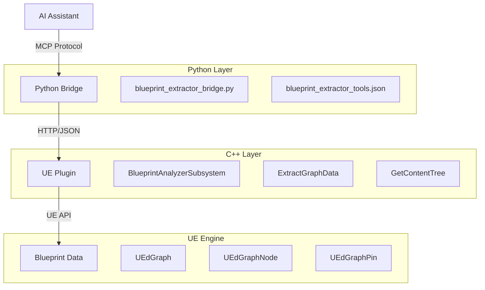

# Design Document: Blueprint Analysis Enhancement

## Overview

本设计文档描述了 UE Toolkit 蓝图分析功能增强的技术实现方案。该功能旨在解决当前 AI 助手无法有效分析 Unreal Engine 蓝图的核心问题：数据不完整、缺少连接关系、编码错误和资产浏览效率低下。

核心目标：

- 提取完整的蓝图图表数据（节点、引脚、连线）
- 区分执行流（exec）和数据流（data）
- 实现递归资产树获取工具
- 修复中文编码问题
- 提供精确的错误处理

技术栈：

- C++: Unreal Engine 插件开发（BlueprintAnalyzer）
- Python: MCP 桥接服务（blueprint_extractor_bridge.py）
- JSON: 数据序列化格式
- HTTP: UE Remote Control API 通信协议

## Architecture

系统采用三层架构：



```

数据流向：
1. AI 助手通过 MCP 协议调用工具
2. Python Bridge 将请求转换为 HTTP 调用
3. UE Plugin 通过 Remote Control API 接收请求
4. C++ 代码访问 UE 内部数据结构
5. 数据序列化为 JSON 并返回

关键设计决策：
- 使用 UE Remote Control API 而非自定义 HTTP 服务器（利用现有基础设施）
- JSON 作为数据交换格式（跨语言兼容性好）
- 节点 ID 基于内存地址生成（确保唯一性）
- UTF-8 编码贯穿整个数据流（解决中文问题）

## Components and Interfaces

### C++ 层组件

#### BlueprintAnalyzerSubsystem

职责：提供蓝图分析的核心功能

关键方法：
```

```cpp
// 修改后的 ExtractGraphData 方法签名
TSharedPtr<FJsonObject> ExtractGraphData(UEdGraph* Graph);

// 新增的 GetContentTree 方法
FString GetContentTree(const FString& RootPath);
```

ExtractGraphData 重构：

- 为每个节点生成唯一 ID（使用 GetUniqueID() 或内存地址）
- 遍历节点的 Pins 数组提取引脚信息
- 遍历引脚的 LinkedTo 数组提取连线关系
- 区分 exec 和 data 类型（通过 PinType.PinCategory）

GetContentTree 实现：

- 递归遍历 AssetRegistry 的目录结构
- 构建树形 JSON 数据
- 包含文件夹和资产信息
- 支持指定根路径（默认 /Game）

#### 数据结构设计

节点数据结构：

```json
{
  "id": "Node_12345",
  "title": "Print String",
  "class": "K2Node_CallFunction",
  "position": {"x": 100, "y": 200},
  "pins": [...]
}
```

引脚数据结构：

```json
{
  "id": "Pin_67890",
  "name": "InString",
  "direction": "input",
  "category": "data",
  "type": "string"
}
```

连线数据结构：

```json
{
  "sourceNode": "Node_12345",
  "sourcePin": "Pin_67890",
  "targetNode": "Node_54321",
  "targetPin": "Pin_09876",
  "type": "data"
}
```

资产树数据结构：

```json
{
  "name": "Blueprints",
  "type": "folder",
  "path": "/Game/Blueprints",
  "children": [
    {
      "name": "BP_Character",
      "type": "asset",
      "class": "Blueprint",
      "path": "/Game/Blueprints/BP_Character"
    }
  ]
}
```

### Python 层组件

#### blueprint_extractor_bridge.py

职责：MCP 协议实现和 HTTP 请求转发

关键修改：

- 在 get_tools() 中添加 GetContentTree 工具定义
- 确保 JSON 响应使用 ensure_ascii=False
- 增强错误处理逻辑（区分不同错误类型）

错误码映射：

```python
ERROR_CODES = {
    "connection_error": "UE_NOT_RUNNING",
    "404": "ASSET_NOT_FOUND",
    "500": "EXTRACTION_FAILED",
    "json_error": "INVALID_JSON"
}
```

#### blueprint_extractor_tools.json

新增工具定义：

```json
{
  "name": "GetContentTree",
  "description": "获取项目资产的递归树结构，一次性返回完整的目录和资产层级",
  "inputSchema": {
    "type": "object",
    "properties": {
      "RootPath": {
        "type": "string",
        "description": "根路径，默认为 /Game"
      }
    }
  }
}
```

## Data Models

### 核心数据模型

#### BlueprintGraphData

完整的蓝图图表数据模型：

```cpp
struct FBlueprintGraphData
{
    FString GraphName;
    TArray<FNodeData> Nodes;
    TArray<FLinkData> Links;
};

struct FNodeData
{
    FString NodeId;          // 唯一标识符
    FString Title;           // 节点标题
    FString ClassName;       // 节点类名
    FVector2D Position;      // 位置坐标
    TArray<FPinData> Pins;   // 引脚列表
};

struct FPinData
{
    FString PinId;           // 引脚 ID
    FString PinName;         // 引脚名称
    EEdGraphPinDirection Direction;  // input/output
    FString Category;        // exec/data
    FString Type;            // 数据类型（仅 data 引脚）
};

struct FLinkData
{
    FString SourceNodeId;
    FString SourcePinId;
    FString TargetNodeId;
    FString TargetPinId;
    FString LinkType;        // exec/data
};
```

#### AssetTreeNode

资产树节点模型：

```cpp
struct FAssetTreeNode
{
    FString Name;            // 节点名称
    FString Type;            // folder/asset
    FString Path;            // 完整路径
    FString AssetClass;      // 资产类型（仅 asset 节点）
    TArray<FAssetTreeNode> Children;  // 子节点
};
```

#### ErrorResponse

统一错误响应模型：

```cpp
struct FErrorResponse
{
    FString ErrorCode;       // 错误码
    FString ErrorMessage;    // 错误描述
    bool bSuccess;           // 固定为 false
};
```

错误码定义：

- UE_NOT_RUNNING: Unreal Engine 未启动
- PROJECT_NOT_LOADED: 项目未打开
- ASSET_NOT_FOUND: 资产不存在
- EXTRACTION_FAILED: 数据提取失败
- INVALID_JSON: JSON 解析失败

### 数据转换流程

C++ 到 JSON 转换：

1. 使用 TJsonWriter 创建 JSON 写入器
2. 配置 UTF-8 编码：`TJsonWriterFactory<TCHAR, TCondensedJsonPrintPolicy<TCHAR>>::Create(&OutputString)`
3. 使用 FJsonSerializer::Serialize 序列化
4. 确保 HTTP 响应头包含 `Content-Type: application/json; charset=utf-8`

JSON 到 Python 转换：

1. Python requests 库自动处理 UTF-8 解码
2. 使用 `json.dumps(result, ensure_ascii=False)` 保持中文字符
3. MCP 协议传输时保持 UTF-8 编码

### 数据完整性约束

节点 ID 唯一性：

- 在同一蓝图内，每个节点的 ID 必须唯一
- 使用 `Node->GetUniqueID()` 或 `FString::Printf(TEXT("Node_%p"), Node)`

引脚 ID 唯一性：

- 在同一节点内，每个引脚的 ID 必须唯一
- 使用 `Pin->PinId` 或 `FString::Printf(TEXT("Pin_%p"), Pin)`

连线引用完整性：

- 所有连线引用的节点 ID 必须在 nodes 数组中存在
- 所有连线引用的引脚 ID 必须在对应节点的 pins 数组中存在
