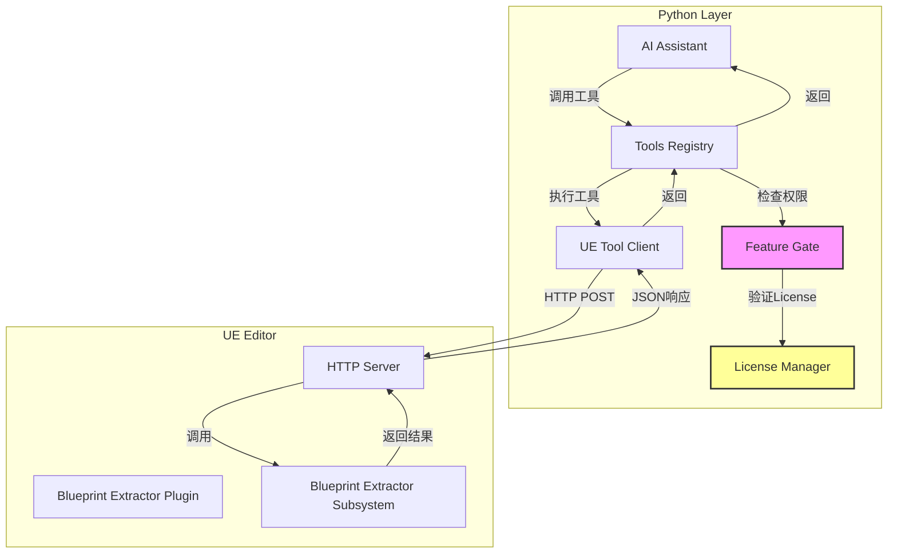
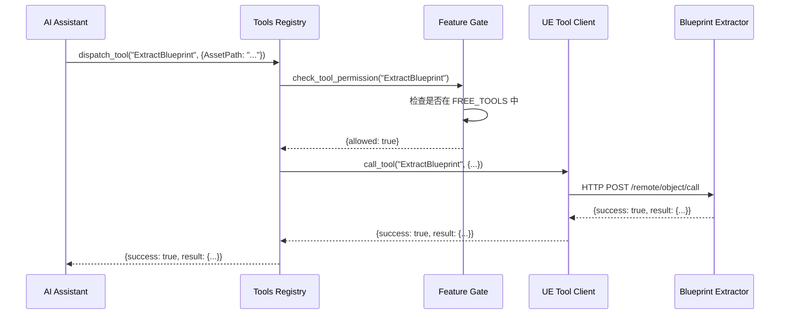
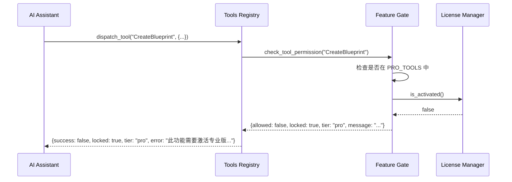
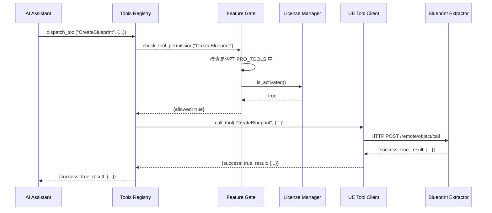
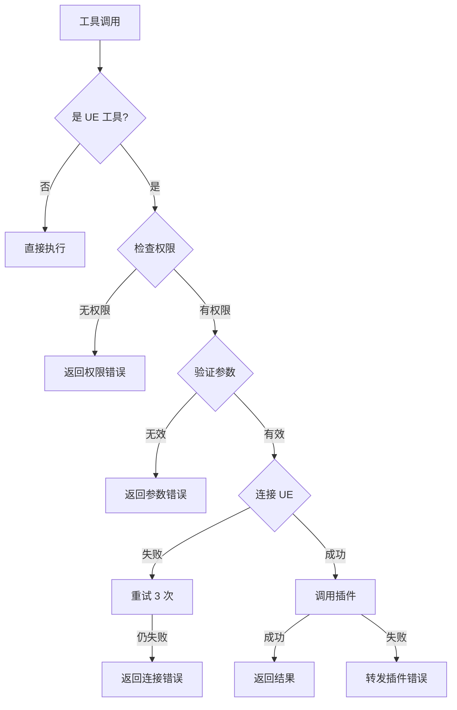

# Design Document: Blueprint Extractor Integration

## Overview

本设计文档描述了将开源项目 `blueprint-extractor` 集成到 UE Toolkit 的技术方案。该集成将替换现有的 `BlueprintToAI` 插件，并实现基于 License 的功能分级系统。

### 核心目标

1. **插件替换**: 用成熟的 blueprint-extractor（112个工具）替换自研的 BlueprintToAI 插件
2. **功能分级**: 实现免费版（18个只读工具）和付费版（94个创建/修改工具）的权限控制
3. **开源合规**: 所有权限控制在 Python 层实现，不修改插件源码
4. **无缝集成**: 保持现有 Tools Registry 架构，最小化对现有代码的影响

### 设计原则

- **分层架构**: 插件层（UE C++）、通信层（HTTP Client）、权限层（Feature Gate）、注册层（Tools Registry）
- **开源友好**: 不修改 blueprint-extractor 源码，保持 MIT License 合规
- **可扩展性**: 工具列表集中管理，易于添加新工具
- **用户友好**: 清晰的错误提示，引导用户激活或修正参数

## Architecture

### 系统架构图



````

### 架构层次

#### 1. 插件层 (Blueprint Extractor Plugin)
- **职责**: 提供 UE 资产操作的核心功能
- **技术**: C++ 插件，基于 UE Subsystem 架构
- **接口**: HTTP Server，监听本地端口（默认 8080）
- **工具数量**: 112 个工具，覆盖 Blueprint、UMG、Material、AI 等资产类型

#### 2. 通信层 (UE Tool Client)
- **职责**: 与 Blueprint Extractor 插件通信
- **技术**: Python HTTP Client（基于 requests 库）
- **端点**: `http://localhost:8080/remote/object/call`
- **协议**: JSON-RPC 风格的 HTTP POST 请求

#### 3. 权限层 (Feature Gate)
- **职责**: 基于 License 控制工具访问权限
- **技术**: Python 类，集成 License Manager
- **策略**:
  - 免费工具（Free Tools）: 18 个只读工具，无需激活
  - 付费工具（Pro Tools）: 94 个创建/修改工具，需要激活
- **特点**: 仅对 UE 工具进行权限检查，不影响其他工具

#### 4. 注册层 (Tools Registry)
- **职责**: 管理所有工具的注册、调度和执行
- **技术**: Python 类，维护工具字典
- **功能**:
  - 注册工具（名称、描述、参数 Schema）
  - 调度工具（权限检查 + 执行）
  - 返回结果（统一格式）

### 关键设计决策

#### 决策 1: 权限控制在 Python 层实现
- **原因**: 保持开源合规，不修改 blueprint-extractor 源码
- **实现**: Feature Gate 在工具执行前拦截，检查 License 状态
- **优势**:
  - 符合 MIT License 要求
  - 易于维护和更新
  - 可以灵活调整免费/付费工具列表

#### 决策 2: 使用 Subsystem 路径而非类名
- **原因**: Blueprint Extractor 使用 Subsystem 架构
- **实现**: 使用 `/Script/BlueprintExtractor.Default__BlueprintExtractorSubsystem`
- **优势**:
  - 符合 UE 5.6+ 的最佳实践
  - 支持 Subsystem 的生命周期管理
  - 与插件官方文档一致

#### 决策 3: 工具列表集中定义
- **原因**: 便于维护和扩展
- **实现**: 在 Feature Gate 中定义 FREE_TOOLS 和 PRO_TOOLS 常量
- **优势**:
  - 单一数据源，避免不一致
  - 易于添加新工具
  - 便于测试和验证

## Components and Interfaces

### Component 1: Feature Gate

#### 职责
- 管理免费工具和付费工具的定义
- 检查工具访问权限
- 返回友好的权限错误信息

#### 接口

```python
class FeatureGate:
    def __init__(self, license_manager: LicenseManager):
        """初始化 Feature Gate，注入 License Manager"""
        pass

    def check_tool_permission(self, tool_name: str) -> dict:
        """
        检查工具权限

        Args:
            tool_name: 工具名称（如 "CreateBlueprint"）

        Returns:
            {
                "allowed": bool,
                "locked": bool,  # 如果被锁定
                "tier": str,     # "free" 或 "pro"
                "message": str   # 错误提示信息
            }
        """
        pass

    def is_ue_tool(self, tool_name: str) -> bool:
        """判断是否为 UE 工具（需要权限检查）"""
        pass
````

#### 工具分类

**免费工具 (FREE_TOOLS) - 18 个只读工具**:

```python
FREE_TOOLS = {
    # Blueprint 提取
    "ExtractBlueprint",
    "ExtractActiveBlueprint",
    "GetActiveBlueprint",

    # UMG 提取
    "ExtractWidgetBlueprint",

    # Material 提取
    "ExtractMaterial",

    # 资产搜索和列表
    "SearchAssets",
    "ListAssets",

    # 编辑器上下文
    "GetEditorContext",

    # 其他提取工具
    "ExtractDataTable",
    "ExtractEnum",
    "ExtractStruct",
    "ExtractAnimBlueprint",
    "ExtractBehaviorTree",
    "ExtractBlackboard",
    "ExtractStateMachine",
    "ExtractAnimMontage",
    "ExtractAnimSequence",
    "ExtractSoundCue"
}
```

**付费工具 (PRO_TOOLS) - 94 个创建/修改工具**:

```python
PRO_TOOLS = {
    # Blueprint 创建和修改
    "CreateBlueprint",
    "ModifyBlueprintMembers",
    "AddBlueprintVariable",
    "AddBlueprintFunction",
    "ModifyBlueprintGraph",

    # UMG 创建和修改
    "CreateWidgetBlueprint",
    "ModifyWidget",
    "AddWidgetToCanvas",

    # 资产保存
    "SaveAssets",
    "SaveAllAssets",

    # 导入工具
    "ImportTexture",
    "ImportMesh",
    "ImportSound",
    "ImportAnimation",

    # 截图和验证
    "CaptureViewport",
    "CaptureWidget",

    # PIE 控制
    "StartPIE",
    "StopPIE",

    # LiveCoding
    "CompileLiveCode",

    # ... 其他 80+ 工具
}
```

### Component 2: UE Tool Client

#### 职责

- 建立与 Blueprint Extractor 插件的 HTTP 连接
- 发送工具调用请求
- 处理响应和错误

#### 接口

```python
class UEToolClient:
    def __init__(self, host: str = "localhost", port: int = 8080):
        """初始化 HTTP 客户端"""
        self.base_url = f"http://{host}:{port}"
        self.subsystem_path = "/Script/BlueprintExtractor.Default__BlueprintExtractorSubsystem"

    def call_tool(self, tool_name: str, parameters: dict) -> dict:
        """
        调用 UE 工具

        Args:
            tool_name: 工具名称（如 "ExtractBlueprint"）
            parameters: 工具参数字典

        Returns:
            {
                "success": bool,
                "result": any,      # 工具返回的数据
                "error": str        # 错误信息（如果失败）
            }
        """
        pass

    def verify_connection(self) -> bool:
        """验证与插件的连接是否正常"""
        pass
```

#### HTTP 请求格式

```json
{
  "objectPath": "/Script/BlueprintExtractor.Default__BlueprintExtractorSubsystem",
  "functionName": "ExtractBlueprint",
  "parameters": {
    "AssetPath": "/Game/Blueprints/BP_Character"
  },
  "generateTransaction": false
}
```

#### HTTP 响应格式

成功响应:

```json
{
    "success": true,
    "result": {
        "name": "BP_Character",
        "nodes": [...],
        "variables": [...],
        "functions": [...]
    }
}
```

失败响应:

```json
{
  "success": false,
  "error": "Asset not found: /Game/Blueprints/BP_Character"
}
```

### Component 3: Tools Registry

#### 职责

- 注册所有可用工具
- 调度工具执行
- 集成 Feature Gate 进行权限检查
- 返回统一格式的结果

#### 接口

```python
class ToolsRegistry:
    def __init__(self):
        self.tools = {}
        self.feature_gate = FeatureGate(license_manager)
        self.ue_client = UEToolClient()

    def register_tool(self, name: str, description: str,
                     parameters_schema: dict,
                     function: callable,
                     requires_confirmation: bool = False):
        """注册单个工具"""
        pass

    def _register_blueprint_extractor_tools(self):
        """注册所有 Blueprint Extractor 工具"""
        pass

    def dispatch_tool(self, tool_name: str, parameters: dict) -> dict:
        """
        调度工具执行

        流程:
        1. 检查工具是否存在
        2. 如果是 UE 工具，检查权限
        3. 如果权限通过，执行工具
        4. 返回结果
        """
        pass

    def _execute_ue_python_tool(self, tool_name: str, parameters: dict) -> dict:
        """
        执行 UE 工具的通用方法

        流程:
        1. 调用 Feature Gate 检查权限
        2. 如果被锁定，返回权限错误
        3. 如果允许，调用 UE Tool Client
        4. 返回结果
        """
        pass
```

#### 工具注册示例

```python
def _register_blueprint_extractor_tools(self):
    # 免费工具示例
    self.register_tool(
        name="ExtractBlueprint",
        description="提取蓝图的完整结构，包括节点、变量、函数等",
        parameters_schema={
            "type": "object",
            "properties": {
                "AssetPath": {
                    "type": "string",
                    "description": "蓝图资产路径，如 /Game/Blueprints/BP_Character"
                }
            },
            "required": ["AssetPath"]
        },
        function=lambda params: self._execute_ue_python_tool("ExtractBlueprint", params),
        requires_confirmation=False
    )

    # 付费工具示例
    self.register_tool(
        name="CreateBlueprint",
        description="创建新的蓝图资产",
        parameters_schema={
            "type": "object",
            "properties": {
                "AssetPath": {
                    "type": "string",
                    "description": "新蓝图的保存路径"
                },
                "ParentClass": {
                    "type": "string",
                    "description": "父类路径，如 /Script/Engine.Actor"
                }
            },
            "required": ["AssetPath", "ParentClass"]
        },
        function=lambda params: self._execute_ue_python_tool("CreateBlueprint", params),
        requires_confirmation=True
    )
```

### Component 4: License Manager (已存在)

#### 职责

- 管理 License 激活状态
- 验证 License Key
- 提供激活状态查询接口

#### 接口（已实现）

```python
class LicenseManager:
    def is_activated(self) -> bool:
        """检查 License 是否已激活"""
        pass

    def activate(self, license_key: str) -> bool:
        """激活 License"""
        pass

    def get_license_info(self) -> dict:
        """获取 License 信息"""
        pass
```

## Data Models

### Tool Definition Model

```python
@dataclass
class ToolDefinition:
    name: str                      # 工具名称
    description: str               # 工具描述（中文）
    parameters_schema: dict        # JSON Schema 格式的参数定义
    function: callable             # 工具执行函数
    requires_confirmation: bool    # 是否需要用户确认
    category: str                  # 工具分类（如 "blueprint", "widget", "material"）
```

### Tool Execution Request Model

```python
@dataclass
class ToolExecutionRequest:
    tool_name: str                 # 工具名称
    parameters: dict               # 工具参数
    user_id: str                   # 用户ID（用于日志）
    request_id: str                # 请求ID（用于追踪）
```

### Tool Execution Response Model

```python
@dataclass
class ToolExecutionResponse:
    success: bool                  # 执行是否成功
    result: any                    # 执行结果（JSON 可序列化）
    error: str                     # 错误信息（如果失败）
    locked: bool                   # 是否因权限被锁定
    tier: str                      # 所需层级（"free" 或 "pro"）
    execution_time: float          # 执行时间（秒）
```

### Permission Check Result Model

```python
@dataclass
class PermissionCheckResult:
    allowed: bool                  # 是否允许访问
    locked: bool                   # 是否被锁定
    tier: str                      # 所需层级
    message: str                   # 提示信息
```

### UE HTTP Request Model

```python
@dataclass
class UEHTTPRequest:
    objectPath: str                # Subsystem 路径
    functionName: str              # 函数名称
    parameters: dict               # 参数字典
    generateTransaction: bool      # 是否生成事务（用于撤销）
```

### UE HTTP Response Model

```python
@dataclass
class UEHTTPResponse:
    success: bool                  # 是否成功
    result: any                    # 返回数据
    error: str                     # 错误信息
```

### Blueprint Structure Model (示例)

```python
@dataclass
class BlueprintStructure:
    name: str                      # 蓝图名称
    path: str                      # 资产路径
    parent_class: str              # 父类
    nodes: List[dict]              # 节点列表
    variables: List[dict]          # 变量列表
    functions: List[dict]          # 函数列表
    graphs: List[dict]             # 图表列表
```

### 数据流示例

#### 场景 1: 免费用户调用 ExtractBlueprint



#### 场景 2: 免费用户调用 CreateBlueprint（被阻止）



#### 场景 3: 付费用户调用 CreateBlueprint（成功）



## Correctness Properties

_A property is a characteristic or behavior that should hold true across all valid executions of a system-essentially, a formal statement about what the system should do. Properties serve as the bridge between human-readable specifications and machine-verifiable correctness guarantees._

### Property Reflection

在分析了所有验收标准后，我识别出以下冗余并进行了合并：

1. **文件存在性检查的冗余**: 多个需求（1.4, 13.8, 14.6, 16.3）都要求保留 LICENSE 文件，这些可以合并为一个属性
2. **权限错误格式的冗余**: 需求 3.3 和 10.4-10.8 都在测试权限错误的响应格式，可以合并为一个综合属性
3. **工具执行响应格式的冗余**: 需求 7.4 和 7.5 测试成功/失败响应格式，可以合并为一个属性
4. **免费工具访问的冗余**: 需求 4.10 和 7.1 都在测试免费工具的访问，可以合并
5. **付费工具阻止的冗余**: 需求 5.10 和 7.3 都在测试未激活时付费工具被阻止，可以合并
6. **错误消息中文化的冗余**: 需求 10.8 和 15.5 都要求错误消息为中文，可以合并

### Property 1: 免费工具无需激活即可访问

_For any_ tool in the FREE_TOOLS set, when License is not activated, the Feature Gate should allow access and the tool should execute successfully via UE Tool Client.

**Validates: Requirements 4.10, 7.1, 9.1, 9.2, 9.3**

### Property 2: 付费工具在未激活时被阻止

_For any_ tool in the PRO_TOOLS set, when License is not activated, the Feature Gate should block access and return an error with `success: false`, `locked: true`, and `tier: "pro"`.

**Validates: Requirements 5.10, 7.3, 10.1, 10.2, 10.3, 10.4, 10.5, 10.6**

### Property 3: 付费工具在激活后可访问

_For any_ tool in the PRO_TOOLS set, when License is activated, the Feature Gate should allow access and the tool should execute via UE Tool Client.

**Validates: Requirements 5.11, 7.2**

### Property 4: 非 UE 工具跳过权限检查

_For any_ tool that is not a UE tool (not in FREE_TOOLS or PRO_TOOLS), the Feature Gate should skip permission checks and allow execution.

**Validates: Requirements 3.4**

### Property 5: 工具调度前进行权限检查

_For any_ tool dispatch request, the Tools Registry should check permissions via Feature Gate before executing the tool.

**Validates: Requirements 3.2**

### Property 6: 权限错误消息格式正确且为中文

_For any_ permission denied error, the error message should be in Chinese, suggest activation, and include actionable guidance.

**Validates: Requirements 3.5, 10.7, 10.8, 15.1, 15.5**

### Property 7: 工具注册包含必需字段

_For any_ registered tool, the tool definition should include name, description (in Chinese), parameters schema (valid JSON Schema), function, and confirmation requirement flag.

**Validates: Requirements 6.3, 6.4, 6.5, 6.6**

### Property 8: UE 工具委托给执行方法

_For any_ UE tool (in FREE_TOOLS or PRO_TOOLS), the registered function should delegate to `_execute_ue_python_tool()` method.

**Validates: Requirements 6.7**

### Property 9: 成功执行返回正确格式

_For any_ successful tool execution, the response should include `success: true` and result data in JSON format.

**Validates: Requirements 7.4, 7.6**

### Property 10: 失败执行返回正确格式

_For any_ failed tool execution, the response should include `success: false` and an error message.

**Validates: Requirements 7.5**

### Property 11: 提取的蓝图结构完整

_For any_ valid blueprint asset path, when ExtractBlueprint is called, the returned JSON should include nodes, variables, and functions fields, and be parseable as valid JSON.

**Validates: Requirements 9.4, 9.5, 9.6**

### Property 12: 结果数据匹配插件输出 Schema

_For any_ tool execution result from Blueprint Extractor, the result data should match the plugin's documented output schema.

**Validates: Requirements 7.7**

### Property 13: 连接失败返回描述性错误

_For any_ connection failure to Blueprint Extractor, the UE Tool Client should return a descriptive error message explaining the failure.

**Validates: Requirements 2.3**

### Property 14: 连接建立时验证可访问性

_For any_ successful connection establishment, the UE Tool Client should verify that the Subsystem is accessible.

**Validates: Requirements 2.2**

### Property 15: 编辑器未运行时返回友好提示

_For any_ tool call when UE Editor is not running, the system should return an error message suggesting to start UE Editor.

**Validates: Requirements 15.2**

### Property 16: 参数无效时返回格式提示

_For any_ tool call with invalid parameters, the system should return an error message showing the correct parameter format.

**Validates: Requirements 15.3**

### Property 17: 插件错误被转发给用户

_For any_ error returned by Blueprint Extractor plugin, the UE Toolkit should forward the error message to the user.

**Validates: Requirements 15.4**

### Property 18: 错误消息具有可操作性

_For any_ error message, it should be specific and actionable, providing clear guidance on how to resolve the issue.

**Validates: Requirements 15.6**

### Property 19: 测试脚本验证所有注册工具

_For any_ registered tool, the test script should call it with valid test parameters and report success or failure.

**Validates: Requirements 12.2, 12.4, 12.5**

### Property 20: 不可访问工具报告详细错误

_For any_ tool that is not accessible during testing, the test script should report the tool name and error details.

**Validates: Requirements 12.8**

### Property 21: 版本检测和警告

_For any_ UE version, the system should detect the version and warn if it is not supported (not 5.6 or 5.7).

**Validates: Requirements 17.4**

## Error Handling

### 错误分类

#### 1. 权限错误 (Permission Errors)

- **触发条件**: 未激活 License 时调用付费工具
- **错误格式**:
  ```json
  {
    "success": false,
    "locked": true,
    "tier": "pro",
    "error": "此功能需要激活专业版。请访问设置页面激活您的 License。"
  }
  ```
- **处理策略**:
  - 在 Feature Gate 层拦截
  - 不调用 UE Tool Client
  - 返回友好的中文提示
  - 引导用户激活 License

#### 2. 连接错误 (Connection Errors)

- **触发条件**: UE Editor 未运行或 HTTP 服务器未启动
- **错误格式**:
  ```json
  {
    "success": false,
    "error": "无法连接到虚幻引擎编辑器。请确保编辑器正在运行且 Blueprint Extractor 插件已启用。"
  }
  ```
- **处理策略**:
  - 在 UE Tool Client 层检测
  - 重试机制：最多 3 次，指数退避（1s, 2s, 4s）
  - 返回清晰的错误提示
  - 建议用户检查编辑器状态

#### 3. 参数错误 (Parameter Errors)

- **触发条件**: 工具参数不符合 JSON Schema 定义
- **错误格式**:
  ```json
  {
    "success": false,
    "error": "参数错误：缺少必需参数 'AssetPath'。正确格式：{\"AssetPath\": \"/Game/Blueprints/BP_Example\"}"
  }
  ```
- **处理策略**:
  - 在 Tools Registry 层验证
  - 使用 JSON Schema 验证器
  - 返回具体的错误字段和正确格式示例
  - 帮助用户快速修正

#### 4. 插件执行错误 (Plugin Execution Errors)

- **触发条件**: Blueprint Extractor 插件返回错误
- **错误格式**:
  ```json
  {
    "success": false,
    "error": "资产未找到：/Game/Blueprints/BP_NonExistent。请检查资产路径是否正确。"
  }
  ```
- **处理策略**:
  - 在 UE Tool Client 层接收
  - 直接转发插件的错误消息
  - 添加上下文信息（如工具名称）
  - 保持错误的原始含义

#### 5. 版本兼容性错误 (Version Compatibility Errors)

- **触发条件**: UE 版本不是 5.6 或 5.7
- **错误格式**:
  ```json
  {
    "success": false,
    "error": "检测到虚幻引擎版本 5.5，但 Blueprint Extractor 仅支持 5.6 和 5.7。部分功能可能无法正常工作。"
  }
  ```
- **处理策略**:
  - 在初始化时检测 UE 版本
  - 发出警告但不阻止执行
  - 记录到日志文件
  - 在文档中说明版本适配方法

### 错误处理流程图



### 错误恢复策略

#### 自动重试

- **适用场景**: 网络连接错误、临时性故障
- **重试次数**: 最多 3 次
- **退避策略**: 指数退避（1s, 2s, 4s）
- **放弃条件**: 3 次失败后返回错误

#### 降级处理

- **适用场景**: 版本不兼容、部分功能不可用
- **策略**: 发出警告但继续执行
- **日志记录**: 记录警告信息到日志文件
- **用户通知**: 在 UI 中显示警告横幅

#### 用户引导

- **适用场景**: 所有错误类型
- **策略**: 提供清晰的错误消息和解决步骤
- **示例**:
  - 权限错误 → 引导到激活页面
  - 连接错误 → 提示启动编辑器
  - 参数错误 → 显示正确格式
  - 插件错误 → 提示检查资产路径

## Testing Strategy

### 测试方法论

本项目采用**双重测试方法**，结合单元测试和基于属性的测试（Property-Based Testing, PBT）：

- **单元测试**: 验证特定示例、边缘情况和错误条件
- **属性测试**: 验证跨所有输入的通用属性
- **集成测试**: 验证与 UE Editor 和 Blueprint Extractor 插件的交互

### 测试层次

#### 1. 单元测试 (Unit Tests)

**测试框架**: pytest

**测试范围**:

- Feature Gate 的工具分类逻辑
- License Manager 的激活状态检查
- Tools Registry 的工具注册和调度
- UE Tool Client 的 HTTP 请求构建
- 错误消息的格式和内容

**示例测试用例**:

```python
def test_feature_gate_blocks_pro_tool_without_license():
    """测试未激活时付费工具被阻止"""
    license_manager = MockLicenseManager(activated=False)
    feature_gate = FeatureGate(license_manager)

    result = feature_gate.check_tool_permission("CreateBlueprint")

    assert result["allowed"] == False
    assert result["locked"] == True
    assert result["tier"] == "pro"
    assert "激活" in result["message"]

def test_feature_gate_allows_free_tool_without_license():
    """测试未激活时免费工具可用"""
    license_manager = MockLicenseManager(activated=False)
    feature_gate = FeatureGate(license_manager)

    result = feature_gate.check_tool_permission("ExtractBlueprint")

    assert result["allowed"] == True
    assert result["locked"] == False

def test_tools_registry_registers_minimum_tools():
    """测试至少注册 20 个核心工具"""
    registry = ToolsRegistry()
    registry._register_blueprint_extractor_tools()

    ue_tools = [name for name in registry.tools.keys()
                if name in FREE_TOOLS or name in PRO_TOOLS]

    assert len(ue_tools) >= 20
```

#### 2. 基于属性的测试 (Property-Based Tests)

**测试框架**: Hypothesis (Python)

**配置**: 每个属性测试最少 100 次迭代

**测试范围**:

- 免费工具在任何情况下都可访问（未激活时）
- 付费工具在未激活时总是被阻止
- 付费工具在激活后总是可访问
- 所有工具注册都包含必需字段
- 所有错误消息都是中文且可操作
- 所有成功响应都包含正确格式

**标签格式**: `Feature: integrate-blueprint-extractor, Property {number}: {property_text}`

**示例属性测试**:

```python
from hypothesis import given, strategies as st

@given(st.sampled_from(list(FREE_TOOLS)))
def test_property_1_free_tools_accessible_without_license(tool_name):
    """
    Property 1: 免费工具无需激活即可访问
    Feature: integrate-blueprint-extractor, Property 1: For any tool in FREE_TOOLS,
    when License is not activated, access should be allowed
    """
    license_manager = MockLicenseManager(activated=False)
    feature_gate = FeatureGate(license_manager)

    result = feature_gate.check_tool_permission(tool_name)

    assert result["allowed"] == True, f"Free tool {tool_name} should be accessible"

@given(st.sampled_from(list(PRO_TOOLS)))
def test_property_2_pro_tools_blocked_without_license(tool_name):
    """
    Property 2: 付费工具在未激活时被阻止
    Feature: integrate-blueprint-extractor, Property 2: For any tool in PRO_TOOLS,
    when License is not activated, access should be blocked with correct error format
    """
    license_manager = MockLicenseManager(activated=False)
    feature_gate = FeatureGate(license_manager)

    result = feature_gate.check_tool_permission(tool_name)

    assert result["allowed"] == False
    assert result["locked"] == True
    assert result["tier"] == "pro"
    assert len(result["message"]) > 0

@given(st.sampled_from(list(PRO_TOOLS)))
def test_property_3_pro_tools_accessible_with_license(tool_name):
    """
    Property 3: 付费工具在激活后可访问
    Feature: integrate-blueprint-extractor, Property 3: For any tool in PRO_TOOLS,
    when License is activated, access should be allowed
    """
    license_manager = MockLicenseManager(activated=True)
    feature_gate = FeatureGate(license_manager)

    result = feature_gate.check_tool_permission(tool_name)

    assert result["allowed"] == True

@given(st.text(min_size=1).filter(lambda x: x not in FREE_TOOLS and x not in PRO_TOOLS))
def test_property_4_non_ue_tools_skip_permission_check(tool_name):
    """
    Property 4: 非 UE 工具跳过权限检查
    Feature: integrate-blueprint-extractor, Property 4: For any non-UE tool,
    permission checks should be skipped
    """
    license_manager = MockLicenseManager(activated=False)
    feature_gate = FeatureGate(license_manager)

    # 非 UE 工具应该直接返回允许
    is_ue_tool = feature_gate.is_ue_tool(tool_name)

    assert is_ue_tool == False
```

#### 3. 集成测试 (Integration Tests)

**测试环境**: 需要运行 UE Editor 5.6+ 和 Blueprint Extractor 插件

**测试范围**:

- 插件部署和编译
- HTTP 连接建立和验证
- 实际工具调用和响应
- 资产创建和修改
- 错误处理和恢复

**测试脚本**: `tests/test_blueprint_extractor_integration.py`

**测试用例**:

```python
def test_plugin_compilation():
    """测试插件编译成功"""
    # 验证插件目录存在
    assert os.path.exists("Plugins/BlueprintExtractor")

    # 验证关键文件存在
    assert os.path.exists("Plugins/BlueprintExtractor/BlueprintExtractor.uplugin")
    assert os.path.exists("Plugins/BlueprintExtractor/LICENSE")

def test_connection_to_plugin():
    """测试与插件的连接"""
    client = UEToolClient()

    # 验证连接
    is_connected = client.verify_connection()
    assert is_connected, "Should connect to Blueprint Extractor plugin"

def test_extract_blueprint_integration():
    """测试提取蓝图（集成测试）"""
    registry = ToolsRegistry()

    # 调用 ExtractBlueprint（需要 UE Editor 运行）
    result = registry.dispatch_tool("ExtractBlueprint", {
        "AssetPath": "/Game/ThirdPerson/Blueprints/BP_ThirdPersonCharacter"
    })

    assert result["success"] == True
    assert "nodes" in result["result"]
    assert "variables" in result["result"]
    assert "functions" in result["result"]

def test_create_blueprint_with_license():
    """测试创建蓝图（需要激活 License）"""
    # 激活 License
    license_manager.activate("test-license-key")

    registry = ToolsRegistry()

    # 调用 CreateBlueprint
    result = registry.dispatch_tool("CreateBlueprint", {
        "AssetPath": "/Game/Test/BP_TestActor",
        "ParentClass": "/Script/Engine.Actor"
    })

    assert result["success"] == True

    # 验证蓝图已创建
    verify_result = registry.dispatch_tool("ExtractBlueprint", {
        "AssetPath": "/Game/Test/BP_TestActor"
    })
    assert verify_result["success"] == True
```

#### 4. 工具可访问性测试脚本

**脚本路径**: `tests/verify_tool_accessibility.py`

**功能**:

- 遍历所有注册的工具
- 使用有效的测试参数调用每个工具
- 报告成功或失败
- 记录结果到日志文件

**测试覆盖**:

- 至少 5 个免费工具
- 至少 5 个付费工具（需要激活 License）

**输出格式**:

```
Tool Accessibility Test Report
==============================
Date: 2024-01-15 10:30:00

Free Tools (5/5 passed):
✓ ExtractBlueprint - Success
✓ ExtractWidgetBlueprint - Success
✓ SearchAssets - Success
✓ ListAssets - Success
✓ GetActiveBlueprint - Success

Pro Tools (5/5 passed):
✓ CreateBlueprint - Success
✓ ModifyBlueprintMembers - Success
✓ CreateWidgetBlueprint - Success
✓ SaveAssets - Success
✓ StartPIE - Success

Total: 10/10 tools accessible
```

### 测试数据生成

#### Mock 对象

**MockLicenseManager**:

```python
class MockLicenseManager:
    def __init__(self, activated: bool = False):
        self._activated = activated

    def is_activated(self) -> bool:
        return self._activated

    def activate(self, license_key: str) -> bool:
        self._activated = True
        return True
```

**MockUEToolClient**:

```python
class MockUEToolClient:
    def __init__(self, should_succeed: bool = True):
        self.should_succeed = should_succeed
        self.call_history = []

    def call_tool(self, tool_name: str, parameters: dict) -> dict:
        self.call_history.append((tool_name, parameters))

        if self.should_succeed:
            return {
                "success": True,
                "result": {"mock": "data"}
            }
        else:
            return {
                "success": False,
                "error": "Mock error"
            }
```

#### 测试数据集

**有效的蓝图路径**:

```python
VALID_BLUEPRINT_PATHS = [
    "/Game/ThirdPerson/Blueprints/BP_ThirdPersonCharacter",
    "/Game/Blueprints/BP_GameMode",
    "/Game/UI/BP_MainMenu"
]
```

**无效的蓝图路径**:

```python
INVALID_BLUEPRINT_PATHS = [
    "/Game/NonExistent/BP_Fake",
    "/Invalid/Path",
    ""
]
```

### 测试覆盖率目标

- **代码覆盖率**: 至少 80%
- **分支覆盖率**: 至少 75%
- **属性测试迭代**: 每个属性至少 100 次
- **集成测试**: 覆盖所有关键用户场景

### 持续集成 (CI)

**CI 流程**:

1. 运行单元测试（不需要 UE Editor）
2. 运行属性测试（不需要 UE Editor）
3. 生成测试报告和覆盖率报告
4. 集成测试在单独的环境中运行（需要 UE Editor）

**CI 工具**: GitHub Actions 或 GitLab CI

**测试命令**:

```bash
# 运行单元测试
pytest tests/unit/ -v

# 运行属性测试
pytest tests/property/ -v --hypothesis-show-statistics

# 运行集成测试（需要 UE Editor）
pytest tests/integration/ -v --ue-editor-required

# 生成覆盖率报告
pytest --cov=core --cov-report=html
```

### 测试维护策略

#### 测试更新触发条件

- 添加新工具时，更新工具列表和测试用例
- 修改权限逻辑时，更新属性测试
- 修改错误消息时，更新单元测试断言
- Blueprint Extractor 插件更新时，更新集成测试

#### 测试文档

- 每个测试文件包含清晰的文档字符串
- 属性测试标注对应的设计属性编号
- 集成测试说明前置条件（如 UE Editor 版本）
- 测试失败时提供调试指南

## Implementation Roadmap

### Phase 1: 核心基础设施 (1-2 天)

1. **Feature Gate 实现**
   - 定义 FREE_TOOLS 和 PRO_TOOLS 常量
   - 实现权限检查逻辑
   - 集成 License Manager
   - 编写单元测试

2. **UE Tool Client 更新**
   - 更新 Subsystem 路径
   - 实现连接验证
   - 添加重试机制
   - 编写单元测试

### Phase 2: 工具注册 (2-3 天)

3. **Tools Registry 更新**
   - 实现 `_register_blueprint_extractor_tools()` 方法
   - 注册至少 20 个核心工具
   - 集成 Feature Gate 到调度流程
   - 编写属性测试

4. **错误处理**
   - 实现各类错误的处理逻辑
   - 编写友好的中文错误消息
   - 添加错误恢复机制
   - 编写单元测试

### Phase 3: 插件部署和清理 (1 天)

5. **文件管理**
   - 部署 Blueprint Extractor 插件
   - 删除旧的 BlueprintToAI 插件
   - 清理临时文件
   - 保留必要的文档和 LICENSE

6. **文档更新**
   - 更新 README.md
   - 添加第三方组件归属
   - 说明免费/付费功能差异
   - 更新版本兼容性说明

### Phase 4: 测试和验证 (2-3 天)

7. **单元测试和属性测试**
   - 编写所有单元测试
   - 编写所有属性测试
   - 达到 80% 代码覆盖率

8. **集成测试**
   - 编写集成测试脚本
   - 编写工具可访问性测试脚本
   - 在 UE 5.6 环境中验证

9. **端到端测试**
   - 测试免费功能（未激活）
   - 测试付费功能阻止（未激活）
   - 测试付费功能（已激活）
   - 验证所有错误场景

### Phase 5: 优化和发布 (1 天)

10. **性能优化**
    - 优化权限检查性能（< 10ms）
    - 优化工具调用性能（< 5s）
    - 添加性能监控

11. **最终验证**
    - 代码审查
    - 文档审查
    - 用户验收测试
    - 准备发布

**总计**: 7-10 天

## Risk Mitigation

### 风险 1: Blueprint Extractor 版本兼容性

- **影响**: 高
- **缓解措施**:
  - 优先支持 UE 5.6
  - 实现版本检测和警告
  - 在文档中明确说明支持的版本
  - 计划未来版本的适配工作

### 风险 2: 开源合规性

- **影响**: 高
- **缓解措施**:
  - 所有权限控制在 Python 层实现
  - 不修改插件源码
  - 保留原始 LICENSE 文件
  - 在 README 中添加归属信息

### 风险 3: 用户体验（权限错误）

- **影响**: 中
- **缓解措施**:
  - 编写友好的中文错误消息
  - 提供清晰的激活引导
  - 在 UI 中突出显示免费/付费功能差异
  - 提供详细的文档和 FAQ

### 风险 4: 工具数量管理

- **影响**: 中
- **缓解措施**:
  - 集中定义工具列表
  - 使用自动化测试验证所有工具
  - 编写工具可访问性测试脚本
  - 定期审查和更新工具列表

### 风险 5: 性能问题

- **影响**: 低
- **缓解措施**:
  - 权限检查使用简单的集合查找（O(1)）
  - HTTP 连接复用
  - 添加性能监控和日志
  - 设置性能目标并在测试中验证

## Appendix

### 工具完整列表

#### 免费工具 (18 个)

1. ExtractBlueprint - 提取蓝图结构
2. ExtractActiveBlueprint - 提取当前活动蓝图
3. GetActiveBlueprint - 获取当前活动蓝图路径
4. ExtractWidgetBlueprint - 提取 UMG Widget
5. ExtractMaterial - 提取材质
6. SearchAssets - 搜索资产
7. ListAssets - 列出资产
8. GetEditorContext - 获取编辑器上下文
9. ExtractDataTable - 提取数据表
10. ExtractEnum - 提取枚举
11. ExtractStruct - 提取结构体
12. ExtractAnimBlueprint - 提取动画蓝图
13. ExtractBehaviorTree - 提取行为树
14. ExtractBlackboard - 提取黑板
15. ExtractStateMachine - 提取状态机
16. ExtractAnimMontage - 提取动画蒙太奇
17. ExtractAnimSequence - 提取动画序列
18. ExtractSoundCue - 提取声音提示

#### 付费工具 (94 个，部分列表)

1. CreateBlueprint - 创建蓝图
2. ModifyBlueprintMembers - 修改蓝图成员
3. AddBlueprintVariable - 添加蓝图变量
4. AddBlueprintFunction - 添加蓝图函数
5. ModifyBlueprintGraph - 修改蓝图图表
6. CreateWidgetBlueprint - 创建 Widget 蓝图
7. ModifyWidget - 修改 Widget
8. AddWidgetToCanvas - 添加 Widget 到画布
9. SaveAssets - 保存资产
10. SaveAllAssets - 保存所有资产
11. ImportTexture - 导入纹理
12. ImportMesh - 导入网格
13. ImportSound - 导入声音
14. ImportAnimation - 导入动画
15. CaptureViewport - 截取视口
16. CaptureWidget - 截取 Widget
17. StartPIE - 启动 PIE
18. StopPIE - 停止 PIE
19. CompileLiveCode - 编译 LiveCode
20. ... (其他 75 个工具)

### 参考资料

- [Blueprint Extractor GitHub Repository](https://github.com/example/blueprint-extractor)
- [Blueprint Extractor Documentation](https://github.com/example/blueprint-extractor/blob/main/README.md)
- [Unreal Engine 5.6 Documentation](https://docs.unrealengine.com/5.6/)
- [MIT License](https://opensource.org/licenses/MIT)
- [Hypothesis Documentation](https://hypothesis.readthedocs.io/)
- [pytest Documentation](https://docs.pytest.org/)
