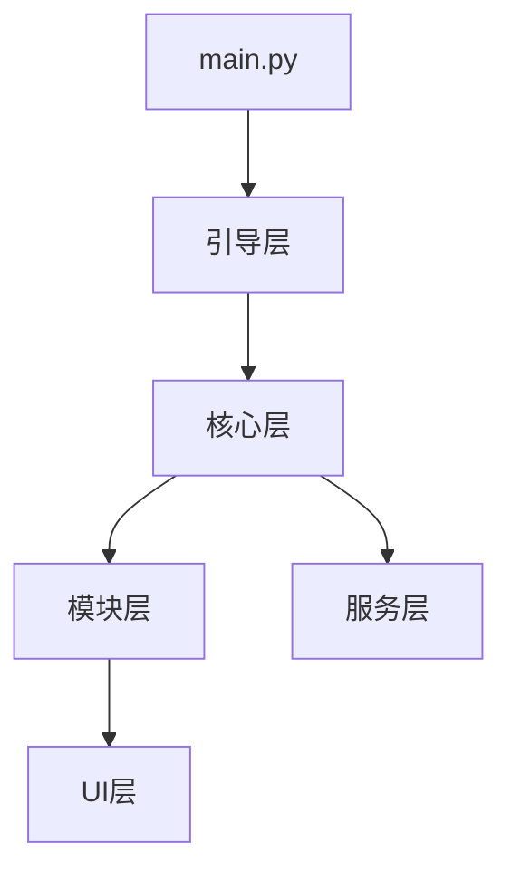
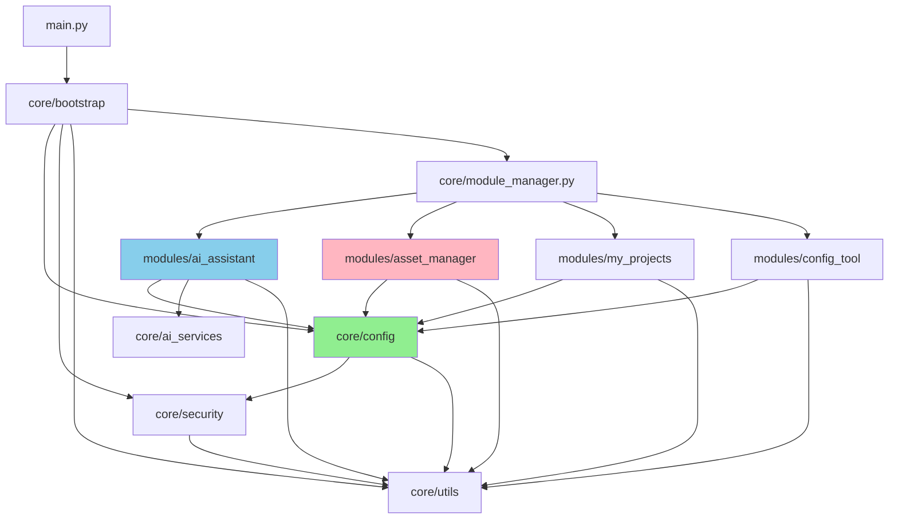

# UE Toolkit - AI 代理开发指南

## 项目概览

UE Toolkit 是一个专为虚幻引擎开发者设计的桌面工具箱，提供工程管理、资产管理、AI 助手和配置工具等功能。

**版本**: v1.2.52  
**语言**: Python 3.8+  
**UI 框架**: PyQt6  
**架构**: 模块化插件系统

## 快速导航

### 核心目录

```
UE_Toolkit/
├── main.py                    # 应用入口
├── version.py                 # 版本管理（单一真实来源）
├── core/                      # 核心模块
│   ├── bootstrap/            # 启动引导
│   ├── config/               # 配置管理
│   ├── security/             # 安全与许可证
│   └── utils/                # 工具类
├── modules/                   # 功能模块
│   ├── ai_assistant/         # AI 助手
│   ├── asset_manager/        # 资产管理
│   ├── my_projects/          # 工程管理
│   └── config_tool/          # 配置工具
├── ui/                        # UI 组件
├── scripts/                   # 脚本工具
│   ├── package/              # 打包脚本
│   └── mcp_servers/          # MCP 服务器
└── Docs/                      # 文档
```

### 关键入口点

- **应用启动**: `main.py` → `core/bootstrap/app_bootstrap.py`
- **模块管理**: `core/module_manager.py`
- **配置管理**: `core/config/config_manager.py`
- **AI 助手**: `modules/ai_assistant/ai_assistant.py`
- **资产管理**: `modules/asset_manager/asset_manager.py`

## 架构概览

### 分层架构（Facade 重构后）



**层次说明**:

1. **引导层**: 协调启动流程（AppBootstrap, AppInitializer, ModuleLoader, UILauncher）
2. **核心层**: 基础设施（ModuleManager, ConfigManager, Logger, Security）
3. **模块层**: 业务功能（AI 助手、资产管理、工程管理、配置工具）
4. **UI 层**: 用户界面（主窗口、设置、对话框、系统托盘）
5. **服务层**: 公共服务（AI 服务、MCP 桥接、更新检查）

**重要变更（2024-01 Facade 重构）**:

- ✅ 移除冗余的 `core/asset_manager_facade.py` Facade 层
- ✅ 资产管理器逻辑主权回归 `modules/asset_manager/asset_manager_logic.py`
- ✅ 业务模块直接调用 `core/config/config_manager.py`
- ✅ 架构从 3 层简化为 2 层，调用链更直接
- ✅ 代码行数减少 ~500 行，模块耦合度降低

### 组件依赖关系图



**关键特征**:

- **扁平化调用**: 业务模块直接调用 `core/config`，无中间层
- **逻辑主权**: 各模块拥有独立的业务逻辑文件（`*_logic.py`）
- **低耦合**: 模块间无直接依赖，通过核心层通信
- **无循环依赖**: 通过拓扑排序验证

### 模块系统

**模块发现**: 扫描 `modules/` 目录，解析 `manifest.json`

**模块接口**:

```python
class ModuleInterface:
    def initialize(self, config_dir: str) -> bool
    def get_widget(self) -> QWidget
    def request_stop(self) -> None
    def cleanup(self) -> CleanupResult
```

**模块依赖**: 支持依赖声明、拓扑排序、循环检测

## 开发工具和模式

### 配置管理

**ConfigManager** 提供统一的配置管理：

```python
from core.config.config_manager import ConfigManager
from pathlib import Path

# 全局配置实例（用户ID、跳过版本等）
global_config_manager = ConfigManager(
    module_name="global",
    template_path=Path("core/config_templates/global_config_template.json")
)

# 获取配置
config = global_config_manager.get_module_config()

# 获取用户ID
user_id = config.get("user_id")

# 设置用户ID
if not user_id:
    import uuid
    user_id = str(uuid.uuid4())
    global_config_manager.update_config_value("user_id", user_id)

# 模块配置实例（现有用法）
module_config_manager = ConfigManager(
    module_name="module_name",
    template_path=Path("modules/module_name/config_template.json")
)

# 保存配置
module_config_manager.save_user_config(config, backup_reason="user_change")

# 更新单个值
module_config_manager.update_config_value("settings.theme", "dark")
```

**特性**:

- 模板和用户配置分离
- 自动版本升级
- 配置缓存（5 分钟）
- 自动备份和恢复

### 日志系统

```python
from core.logger import get_logger

logger = get_logger(__name__)
logger.info("操作成功")
logger.error("操作失败", exc_info=True)
```

**日志位置**: `logs/runtime/ue_toolkit.log`

### 许可证管理

```python
from core.security.license_manager import get_license_status

status = get_license_status()
if status.is_valid:
    # 执行付费功能
    pass
```

**功能权限控制**:

```python
from core.security.feature_gate import require_license

@require_license(tier="pro")
def premium_feature():
    pass
```

## 主要功能模块

### 1. AI 助手模块

**位置**: `modules/ai_assistant/`

**核心功能**:

- 多 LLM 提供商支持（OpenAI、Claude、Gemini、DeepSeek、Ollama）
- 工具调用系统
- MCP 协议集成（26+ 蓝图操作工具）
- 对话历史管理

**LLM 客户端**:

- `APILLMClient`: API 调用客户端
- `OllamaLLMClient`: 本地模型客户端
- `UEToolClient`: UE 工具客户端
- `BlueprintAnalyzerClient`: 蓝图分析客户端（UE 5.4）

**工具系统**: 支持资产、工程、配置操作的工具调用

### 2. 资产管理模块

**位置**: `modules/asset_manager/`

**核心功能**:

- 资产导入（自动识别类型、解压、过滤）
- 资产导出（复制到目标工程）
- 资产预览（在预览工程中打开）
- 缩略图生成
- 资产搜索和过滤

**支持的资产类型**:

- CONTENT: 资产包
- PLUGIN: 插件
- PROJECT: 完整工程
- OTHERS: 通用多媒体

### 3. 工程管理模块

**位置**: `modules/my_projects/`

**核心功能**:

- 自动扫描本地 UE 项目
- 多版本工程管理
- 快速启动
- 工程重命名（蓝图工程）

### 4. 配置工具模块

**位置**: `modules/config_tool/`

**核心功能**:

- 项目配置提取和应用
- 编辑器偏好设置同步
- 配置备份和回滚
- 版本匹配检查

## MCP 协议集成

### MCP Bridge

**位置**: `scripts/mcp_servers/blueprint_extractor_bridge.py`

**功能**: 连接 UE Editor HTTP API，提供标准 MCP 协议接口

**工具定义**: `scripts/mcp_servers/blueprint_extractor_tools.json`

**可用工具**:

- 免费工具（18 个）: 只读操作（提取蓝图、搜索资产等）
- 付费工具（8 个）: 创建/修改操作（创建蓝图、修改组件等）

**使用流程**:

1. AI 助手调用 MCP 客户端
2. MCP 客户端发送 JSON-RPC 请求到 Bridge
3. Bridge 调用 UE Editor HTTP API
4. 返回结果给 AI 助手

## 开发指南

### 添加新模块

1. 在 `modules/` 下创建模块目录
2. 创建 `manifest.json`:

```json
{
  "name": "module_name",
  "display_name": "模块名称",
  "version": "1.0.0",
  "description": "模块描述",
  "author": "作者",
  "dependencies": [],
  "entry_point": "module_file.ModuleClass",
  "enabled": true
}
```

3. 实现 `ModuleInterface` 接口
4. 创建模块 UI 组件
5. 模块管理器自动发现和加载

### 添加新工具（AI 助手）

1. 在模块中实现工具函数
2. 注册到工具系统:

```python
def _init_tools_system(self):
    self.tools = {
        "tool_name": {
            "function": self.tool_function,
            "description": "工具描述",
            "parameters": {...}
        }
    }
```

3. AI 助手自动识别和调用

### 添加新 LLM 提供商

1. 继承 `BaseLLMClient`:

```python
class MyLLMClient(BaseLLMClient):
    def send_message(self, messages, stream=False, tools=None, **kwargs):
        # 实现 LLM 调用
        pass
```

2. 在 `LLMClientFactory` 中注册
3. 在配置中添加提供商选项

## 常见开发任务

### 修改配置 Schema

1. 更新 `modules/*/config_schema.py`
2. 更新配置模板 `modules/*/config_template.json`
3. 实现配置升级逻辑（如果需要）
4. 测试配置加载和保存

### 添加新的资产类型

1. 在 `AssetType` 枚举中添加新类型
2. 实现类型检测逻辑
3. 实现导入/导出逻辑
4. 更新 UI 显示

### 修改启动流程

1. 查看 `core/bootstrap/app_bootstrap.py`
2. 修改相应的启动阶段
3. 确保异常处理和资源清理
4. 测试启动和退出流程

## 调试技巧

### 启用详细日志

在 `core/logger.py` 中设置日志级别为 DEBUG

### 查看模块加载

检查 `logs/runtime/ue_toolkit.log` 中的模块加载日志

### 调试 MCP 协议

启用 MCP Bridge 详细日志:

```python
# 在 blueprint_extractor_bridge.py 中
logging.basicConfig(level=logging.DEBUG)
```

### 性能分析

使用 `PerformanceMonitor`:

```python
from core.utils.performance_monitor import PerformanceMonitor

monitor = PerformanceMonitor()
monitor.start("operation")
# 执行操作
duration = monitor.end("operation")
```

## 测试

### 运行测试

```bash
# 运行所有测试
pytest

# 运行特定测试
pytest tests/test_module.py

# 生成覆盖率报告
pytest --cov=. --cov-report=html
```

### 测试框架

- `pytest`: 单元测试
- `pytest-qt`: Qt 组件测试
- `pytest-cov`: 代码覆盖率

## 打包和部署

### 打包应用

```bash
# 运行打包脚本
python scripts/package/build.py
```

**配置文件**: `scripts/package/config/ue_toolkit.spec`

**优化策略**: 排除未使用的 AI 依赖（311MB → 50-80MB）

### 创建安装程序

使用 Inno Setup 和 `scripts/package/config/UeToolkitpack.iss`

## 代码风格和规范

### Python 代码风格

- 遵循 PEP 8
- 使用类型注解
- 编写文档字符串
- 使用 flake8 检查

### 提交规范

```
[类型] 简短描述

详细描述（可选）

相关 Issue: #123
```

**类型**:

- `feat`: 新功能
- `fix`: 修复 bug
- `docs`: 文档更新
- `style`: 代码格式
- `refactor`: 重构
- `test`: 测试
- `chore`: 构建/工具

## 性能优化

### 启动优化

- 异步加载模块
- 延迟初始化非关键组件
- 预加载常用资源
- 使用配置缓存

### 运行时优化

- 使用线程池处理耗时操作
- 懒加载 AI 模型
- 定期清理缓存
- 监控内存使用

## 安全考虑

- 敏感数据加密存储（cryptography）
- 使用系统密钥环（keyring）
- 许可证验证（本地缓存 + 服务器端）
- 输入验证和清理
- 定期安全扫描（bandit）

## 故障排查

### 应用无法启动

1. 检查 Python 版本（需要 3.8+）
2. 检查依赖是否安装
3. 查看日志文件
4. 检查单实例锁

### 模块加载失败

1. 检查 manifest.json 格式
2. 检查模块依赖
3. 查看模块加载日志
4. 验证模块接口实现

### 配置加载失败

1. 检查配置文件格式
2. 验证配置 Schema
3. 查看配置管理器日志
4. 尝试从备份恢复

### MCP 工具调用失败

1. 确认 UE 编辑器正在运行
2. 检查 Blueprint Extractor 插件已启用
3. 验证 HTTP 服务器监听 30010 端口
4. 查看 MCP Bridge 日志

## 资源和文档

### 内部文档

- **完整文档**: `.agents/summary/` 目录
- **用户指南**: `Docs/USER_GUIDE.md`
- **MCP 集成**: `Docs/MCP_INTEGRATION.md`
- **核心模块**: `core/README.md`

### 外部资源

- **PyQt6 文档**: https://www.riverbankcomputing.com/static/Docs/PyQt6/
- **MCP 协议**: https://modelcontextprotocol.io/
- **虚幻引擎**: https://docs.unrealengine.com/

### 社区支持

- **QQ 群**: 1048699469

## 版本管理

### 版本号规则

**格式**: MAJOR.MINOR.PATCH

- **MAJOR**: 重大变更、不兼容的 API 修改
- **MINOR**: 新功能、向后兼容
- **PATCH**: bug 修复、小改进

**版本文件**: `version.py`（单一真实来源）

### 更新版本

1. 修改 `version.py` 中的 `VERSION` 常量
2. 更新 `scripts/package/config/UeToolkitpack.iss` 中的版本号
3. 提交时使用格式: `[类型] 描述 v版本号`

## Custom Instructions
Skill	用途	关键功能
codebase-summary	代码库分析	生成架构文档、组件分析、AGENTS.md
code-assist	TDD 开发	Explore→Plan→Code→Commit 工作流
code-task-generator	任务拆解	从需求生成结构化任务文件
pdd	提示驱动开发	从想法到详细设计的完整流程
eval	评估框架	使用 Strands Evals SDK 评估 AI 代理

aicoding 编码规范 必须强制遵守
<!-- This section is maintained by developers and agents during day-to-day work.
     It is NOT auto-generated by codebase-summary and MUST be preserved during refreshes.
     Add project-specific conventions, gotchas, and workflow requirements here. -->
